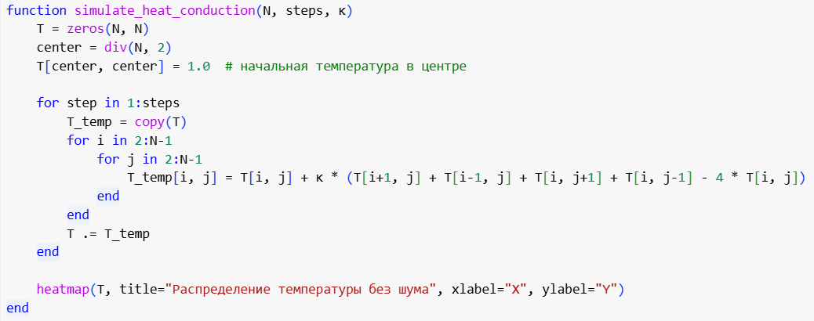
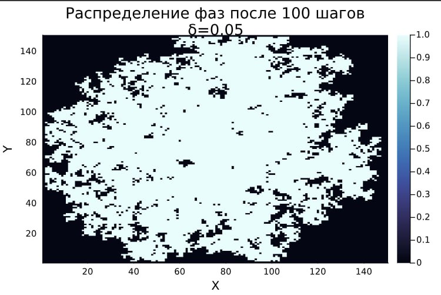

<iframe width="720" height="405" src="https://rutube.ru/play/embed/8d17b15b60b0f12d8fa4222d2860cc9d/" frameBorder="0" allow="clipboard-write; autoplay" webkitAllowFullScreen mozallowfullscreen allowFullScreen></iframe>

<iframe width="560" height="315" src="https://plvideo.ru/embed/Pdk1XiznJ3qf" title="Platform video player" allow="accelerometer; autoplay; clipboard-write; encrypted-media; gyroscope; picture-in-picture; web-share" referrerpolicy="strict-origin-when-cross-origin" allowfullscreen></iframe>


## Relevance

The appearance of dendrites plays a key role in metallurgy and foundry production, especially during the solidification of metals and alloys, since the microstructure of the resulting dendrites largely determines the mechanical, electrical and thermal properties of the resulting materials. Studying their characteristics is important not only for a theoretical understanding of crystallization processes, but also for practice, for improving production technologies of modern materials with specified properties.

## Object and subject of research

- Dendrites, 
- Crystalline dendrites

## Goals and objectives

1. Write a program that simulates thermal conductivity. Set the initial temperature to zero at all points except the central one and observe how the temperature distributions change over time.
2. Add the solidification process to the model. To study how the initial hypothermia and capillary radius affect the shape of the dendrites formed.
3. To investigate how the number of particles in the aggregate and its RMS radius change over time in various modes.
4. Determine the fractal dimension of the resulting structures
5. Analyze how the magnitude of thermal noise affects the morphology of the forming aggregates.


# Completing the tasks of the third stage

## Setting basic modeling parameters

```Julia
N = 150 # Grid size (N x N)
T_initial = -1 # Initial temperature at the center point
steps = 200 # Number of time steps
dt = 1 # Time step
h = 1 # Distance between nodes
kappa = 0.1 # Coefficient of thermal conductivity
w = 0.5 # Coefficient for diagonal neighbors
T_m = 0 # Melting
point lambda = 0.01 # Capillary radius
delta = 0.02 # Magnitude of temperature fluctuations
```

## Initializing the grid

```Julia
T = zeros(N, N) # Temperature matrix
n = zeros(Int, N, N) # Matrix of states (0 - liquid, 1 - solid)
T[N÷2+1, N÷2+1] = T_initial # Setting the initial temperature at the central point
n[N÷2+1, N÷2+1] = 1
```

## Basic functions

  - The polynomial approximation method
  - Average temperature value
  - Curvature of the boundary
  - Number of solidified particles
  - RMS radius 


## Basic functions

  - The polynomial approximation method
  - Average temperature value
  - Curvature of the boundary
  - Number of solidified particles
  - RMS radius 


## Basic functions

  - The polynomial approximation method
  - Average temperature value
  - Curvature of the boundary
  - The number of solidified particles 
  - The RMS radius
  


## Thermal conductivity model


The `simulate_heat_conduction` function based on the temperature update equation:



## Adding the solidification process

The `simulate_solidification` function is implemented, which performs the following steps:

1. Temperature update
2. Checking the solidification condition
3. Updating states


## Simulation results. Investigation of the effect of capillary radius

![Investigation of the effect of initial hypothermia and the capillary radius] (4.png)

## Unit growth dynamics


## Fractal dimension


The fractal dimension of $D$ can be determined through logarithmic regression:

$$ 
D = \frac{\log N(r)}{\log r} 
$$

where:

- $N(r)$ is the number of particles inside the radius of $r$
- $D$ is the desired fractal dimension

Implemented the 'fractal_dimension` function

## The effect of thermal noise





## Conclusions

1. The process of thermal conductivity is modeled.
2. The effect of initial hypothermia and capillary radius on the shape of dendrites is investigated.
3. The dynamics of aggregate growth and its fractal dimension are analyzed.
4. The influence of thermal noise on the morphology of aggregates has been studied.

The results show that:

- Thermal noise significantly affects the structure of dendrites, increasing their irregularity and growth rate.
