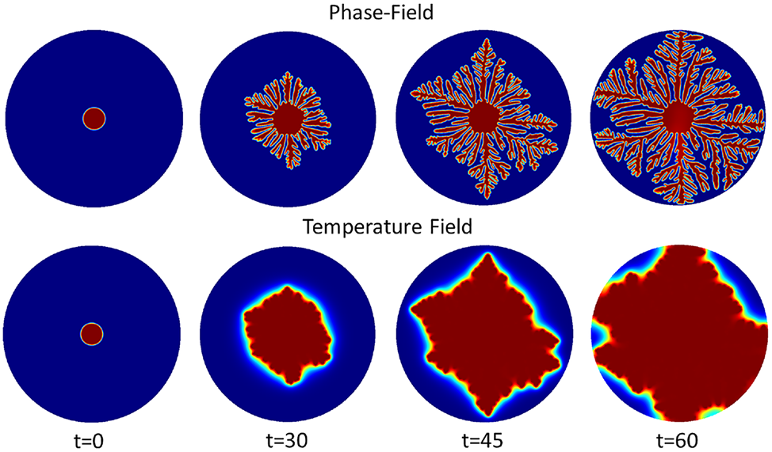

Our research team is working on a project on "Dendrite growth," in which we are exploring a mathematical model of this process, as well as algorithms for solving this problem.

<!--more-->

## General information
Our research team is working on a project on "Dendrite growth," in which we are exploring a mathematical model of this process, as well as algorithms for solving this problem.

Link to general information with all materials on the second stage of the project: https://aachemodanova.github.io/dendrites_group_research/publication/second_stage/

Link to the event with presentations on the second stage of the project: https://aachemodanova.github.io/dendrites_group_research/event/second_stage/

## Relevance

The appearance of dendrites plays a key role in metallurgy and foundry production, especially during the solidification of metals and alloys, since the microstructure of the resulting dendrites largely determines the mechanical, electrical and thermal properties of the resulting materials. Studying their characteristics is important not only for a theoretical understanding of crystallization processes, but also for practice, for improving production technologies for modern materials with specified properties. 
Thus, at the second stage of the group project, an algorithm for solving the problem of crystallization modeling is described. 

**Algorithm** is a systematic sequence of actions necessary to achieve a set goal. In the context of scientific research, algorithms are important not only to improve computational efficiency, but also to ensure reproducibility of results, which is a fundamental requirement of the scientific method.

## Object and subject of research
- Dendrites, 
- Crystalline dendrites

## Goals

To describe an algorithm for solving the problem of modeling dendrite growth.

## Tasks

- Consider an algorithm for constructing a model of dendrite growth.
- Describe the main stages of the algorithm

## Definition

A dendrite is a crystal that develops with a typical branching shape resembling a fractal.  In metals, they are formed during crystallization from a supercooled melt.

# Algorithm

## Step 1: Setting the parameters
- Physical properties of the substance
- Initial conditions

## Step 2: Setting up the simulation grid

- Creation of a simulation grid.
- Initialization of the seed.

## Step 3: Calculation of the temperature field

- Application of the equation of thermal conductivity
- Calculate a new temperature distribution at each time step $\Delta t$
- Update the temperature values at each grid point
- Repeat calculations until a steady state or a preset time is reached.

## Step 4: Modeling Dendrite growth

- The criterion of solidification
- Using Stefan's condition
- Application of the Gibbs-Thomson condition
- Updating the parameters
- Determination of fractal dimension

## Step 5: Analyzing the structure of dendrites
- Morphological analysis
- Correlation analysis
- Investigation of the effect of thermal noise $\delta$

## Step 6: Process Visualization

## Conclusions
The second stage of the group project on "Dendrite growth" has been completed. As a result, the process of creating an algorithm for modeling dendrite growth was described, which includes all key stages: from setting initial parameters and configuring the computational grid to modeling the growth process and detailed analysis of the obtained structures. 

## Result
The first stage of the group project on "Dendrite growth" has been completed, as a result of which we studied the materials on the scientific problem, compiled a theoretical description of the dendrite growth model and identified the tasks of further research.

# See also

## Materials of the first stage

Link to general information with all materials on the first stage of the project: https://aachemodanova.github.io/dendrites_group_research/publication/first_stage/

Link to the event with presentations on the first stage of the project: https://aachemodanova.github.io/dendrites_group_research/event/first_stage/
