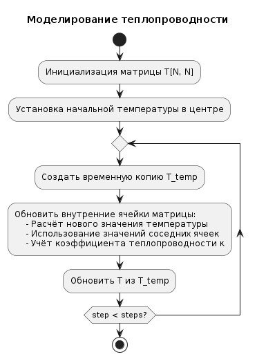

Our research team is working on a project on "Dendrite growth," in which we are exploring a mathematical model of this process, as well as algorithms for solving this problem.

<!--more-->

## General information
Our research team is working on a project on "Dendrite growth," in which we are exploring a mathematical model of this process, as well as algorithms for solving this problem.

Link to general information with all materials on the fourth stage of the project: https://aachemodanova.github.io/dendrites_group_research/publication/fourth_stage/

Link to the event with presentations on the fourth stage of the project: https://aachemodanova.github.io/dendrites_group_research/event/fourth_stage/

## Relevance

The appearance of dendrites plays a key role in metallurgy and in foundry production, especially in the hardening of metals and alloys.

## Object and subject of research: 

- Dendrites

- Crystalline dendrites

## Goal: 

- To investigate the growth model of dendrites.

- Describe an algorithm for solving the problem of modeling dendrite growth.

- Implement a dendrite growth model and analyze the results.


## Tasks

- Consider the dendrite growth model.

- Consider the algorithm for constructing the model.

- Describe the main stages of the algorithm.

- Write a simulation program.

- Analyze the results.


# Theoretical description of the problem. 

## Basic concepts and equations

### Dendrite formation

$$
S = c_p \frac{(T_m - T_\infty)}{L}\tag{1}
$$

### The equation of thermal conductivity

$$
\rho c_p \frac{\partial T}{\partial t} = \kappa \nabla^2 T \equiv \kappa \left( \frac{\partial^2 T}{\partial x^2} + \frac{\partial^2 T}{\partial y^2} \right)\tag{2}
$$

### Stefan's condition

$$
\mathbf{n} \cdot \mathbf{V} = \frac{\kappa}{\rho L} (\mathbf{n} \cdot \nabla T|_s - \mathbf{n} \cdot \nabla T|_l)\tag{3}
$$

### The Gibbs-Thomson condition

$$
T_b = T_m \left(1 - \frac{\gamma T_m}{\rho L^2 R}\right)\tag{4}
$$

## Dimensionless temperature and the equation of thermal conductivity

The dimensionless temperature $\widetilde{T} = c_p (T - T_\infty)/L$ is introduced, where $T_\infty$ is the initial temperature of the melt. The thermal conductivity equation for $\widetilde{T}$ has the form

$$
\frac{\partial \widetilde{T}}{\partial t} = \chi \nabla^2 \widetilde{T},\tag{5}
$$

where $\chi = \kappa / \rho c_p$ is the thermal conductivity coefficient.

# Model description

## Temperature change

The new temperature value after the $m$ step is calculated using the formula

$$
\hat{T}_{i,j} = T_{i,j} + \frac{\chi \Delta t \nabla^2 T}{m}.\tag{6}
$$


### Dendrite growth

$$
T \leq \tilde{T}_m (1 + \eta_{i,j} \delta) + \lambda s_{i,j},\tag{7}
$$

### Taking into account the curvature of the border 

The curvature of the boundary $1/R$ is approximately calculated from the neighbors of the node:

$$
1/R \approx s_{i,j} = \sum_{1} n_{i,j} + w_n \sum_{2} n_{i,j} - \left( \frac{5}{2} + \frac{5}{2} w_n \right),\tag{8}
$$

## Description of the algorithm



### Step 1: Setting Parameters

### Step 2: Setting up the simulation grid

### Step 3: Calculation of the temperature field

* Application of the equation of thermal conductivity,
* Numerical implementation of the equation

## Description of the algorithm 


### Step 4: Modeling Dendrite growth 

Modeling of dendrite growth is implemented based on calculated temperature fields and corresponding physical laws.

## Definition of fractal dimension

$$
N(r) \sim r^D\tag{9}
$$

where $N(r)$ is the number of points inside a circle of radius $r$.


# The practical part

## Setting the basic parameters of the model

```Julia
using Plots, LinearAlgebra, Statistics

# Model parameters
N = 150 # Grid size (N x N)
T_initial = -1 # Initial temperature at the center point
steps = 200 # Number of time steps
dt = 1 # Time step
h = 1 # Distance between nodes
kappa = 0.1 # Coefficient of thermal conductivity
w = 0.5 # Coefficient for diagonal neighbors
T_m = 0 # Melting point
$\lambda$ = 0.01 # Capillary radius
$\delta$ = 0.02 # Magnitude of temperature fluctuations
```

## Инициализация сетки
    
```Julia
# Initializing the grid
T = zeros(N, N) # Temperature matrix
n = zeros(Int, N, N) # Matrix of states (0 - liquid, 1 - solid)
T[N÷2+1, N÷2+1] = T_initial # Setting the initial temperature at the central point
n[N÷2+1, N÷2+1] = 1
```

## Basic functions

  - The polynomial approximation method
  - Average temperature value
  - Curvature of the boundary
  - Number of solidified particles
  - RMS radius 

## Thermal conductivity model


## Adding the solidification process

The `simulate_solidification` function is implemented, which performs the following steps:

1. Temperature update
2. Checking the solidification condition
3. Updating states


## Simulation results. Investigation of the effect of capillary radius


## Unit growth dynamics


## Fractal dimension


The fractal dimension of $D$ can be determined through logarithmic regression:

$$ 
D = \frac{\log N(r)}{\log r} 
\tag{10}
$$

where:

- $N(r)$ is the number of particles inside the radius of $r$
- $D$ is the desired fractal dimension

Implemented the 'fractal_dimension` function

## The effect of thermal noise


# Conclusions

During the group project, we:

- we have made a theoretical description of the dendrite growth model and identified the tasks of further research,

- we described the process of creating an algorithm for modeling dendrite growth, which includes all the key steps

- we have modeled the process of thermal conductivity.

- the effect of initial hypothermia and capillary radius on the shape of dendrites was investigated,

- analyzed the growth dynamics of the aggregate and its fractal dimension,

- we studied the effect of thermal noise on the morphology of aggregates.


# See also

## Materials of the third stage

Link to general information with all materials on the third stage of the project: https://aachemodanova.github.io/dendrites_group_research/publication/third_stage/

Link to the event with presentations on the third stage of the project: https://aachemodanova.github.io/dendrites_group_research/event/third_stage/

## Materials of the second stage

Link to general information with all materials on the second stage of the project: https://aachemodanova.github.io/dendrites_group_research/publication/second_stage/

Link to the event with presentations on the second stage of the project: https://aachemodanova.github.io/dendrites_group_research/event/second_stage/

## Materials of the first stage

Link to general information with all materials on the first stage of the project: https://aachemodanova.github.io/dendrites_group_research/publication/first_stage/

Link to the event with presentations on the first stage of the project: https://aachemodanova.github.io/dendrites_group_research/event/first_stage/
