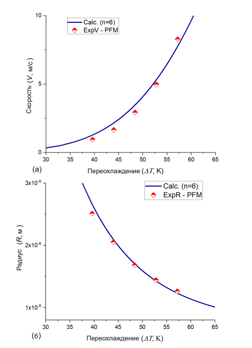
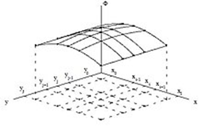
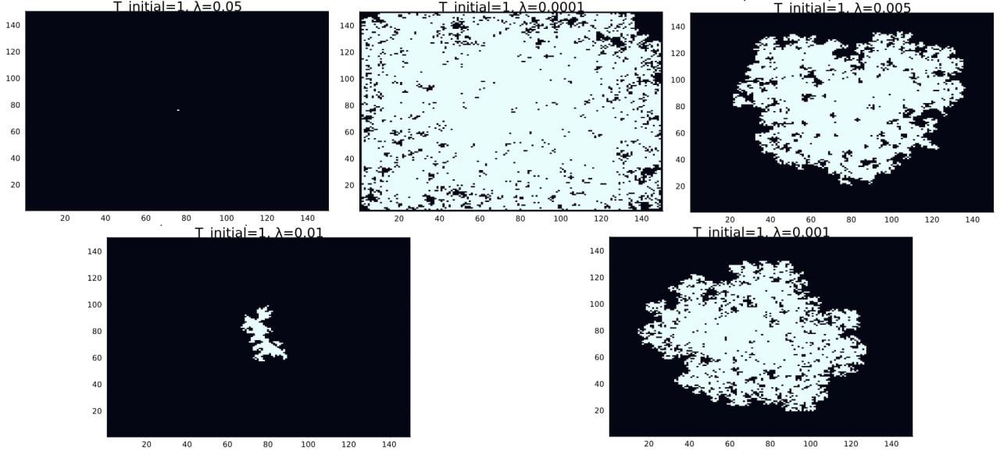

<iframe width="720" height="405" src="https://rutube.ru/play/embed/8d17b15b60b0f12d8fa4222d2860cc9d/" frameBorder="0" allow="clipboard-write; autoplay" webkitAllowFullScreen mozallowfullscreen allowFullScreen></iframe>

<iframe width="560" height="315" src="https://plvideo.ru/embed/Pdk1XiznJ3qf" title="Platform video player" allow="accelerometer; autoplay; clipboard-write; encrypted-media; gyroscope; picture-in-picture; web-share" referrerpolicy="strict-origin-when-cross-origin" allowfullscreen></iframe>

# Introduction

## Relevance

The appearance of dendrites plays a key role in metallurgy and in foundry production, especially during the solidification of metals and alloys, since the microstructure of the resulting dendrites largely determines the mechanical, electrical and thermal properties of the obtained materials. Studying their characteristics is important not only for a theoretical understanding of crystallization processes, but also for practice, for improving production technologies of modern materials with specified properties. 
Thus, the scientific problem is to develop theoretical and numerical models capable of accurately predicting the dynamics of dendrite growth and their effect on the microstructure of formed materials. 


## Object and subject of research

- Dendrites

- Crystalline dendrites

## Goal 

- To investigate the growth model of dendrites.

- Describe an algorithm for solving the problem of modeling dendrite growth.

- Implement a dendrite growth model and analyze the results.

## Tasks

- Consider a combined model of dendrite growth.

- Consider an algorithm for constructing a model of dendrite growth.

- Describe the main stages of the algorithm

- Write a program that simulates thermal conductivity. Set the initial temperature to zero at all points except the central one and observe how the temperature distributions change over time.

- Add the solidification process to the model. To study how the initial hypothermia and capillary radius affect the shape of the dendrites formed.

- To investigate how the number of particles in the aggregate and its RMS radius change over time in various modes.

- Determine the fractal dimension of the resulting structures

- To analyze how the magnitude of thermal noise affects the morphology of the forming aggregates.

# Theoretical description of the problem.

## Definitions

A dendrite is a crystal that develops with a typical branching shape, resembling a fractal.  In metals, they are formed during crystallization from a supercooled melt.

The anisotropy of a crystal is the dependence of the physical properties of a crystal on the direction of growth. That is, the crystal structure is not symmetrical, and there are several axes along which the crystal exhibits various properties (mechanical, electrical, optical).

Anisotropy is a natural consequence of the crystalline structure, since the density of atoms varies on different crystallographic planes and along different directions.

Next, we will consider the formation of a crystalline structure from a supercooled melt.

## Basic concepts and equations

### Dendrite formation

The formation of dendrites begins with some nucleation, i.e. the first appearance of solid growth in a supercooled liquid. This formation will initially grow spherically until this shape is no longer stable. The instability of the shape has two reasons: the anisotropy of the surface energy of the solid-liquid boundary and the kinetics of attachment of particles to crystallographic planes during their formation.

It is necessary to specify the physical properties of the substance:

- density $\rho$,
- specific heat of melting per unit mass $L$, 
- heat capacity at constant pressure $c_p$ (also per unit mass),
- coefficient of thermal conductivity $\kappa$ (for simplicity, we will consider thermal conductivity and density independent of temperature and the same for solid and liquid phases – the so-called symmetric model),
- melting point $T_m$.

Let the initial temperature of the melt be less than the melting point (i.e., it is supercooled) $T_{\infty}<T_m$.  

In the context of crystallization from a supercooled melt, dimensionless supercooling S is introduced to normalize and simplify mathematical models of the process. This parameter characterizes the degree of supercooling of the melt relative to its melting point, which is critical for initiation and crystallization rate. It is calculated using the formula.

$$
S = c_p \frac{(T_m - T_\infty)}{L}
$$


Adiabatic conditions imply the absence of heat exchange with the environment, which means the conservation of thermal energy within the system. Under such conditions, at $S\geq 1$, the entire melt solidifies, since there is a sufficient temperature difference to ensure the crystallization process. At $S <1$, only a part of the melt solidifies, and we will consider this case.

We also restrict ourselves to the two-dimensional case. The thermal conductivity equation is used to describe the temperature change over time in the two-dimensional case.

$$
\rho c_p \frac{\partial T}{\partial t} = \kappa \nabla^2 T \equiv \kappa \left( \frac{\partial^2 T}{\partial x^2} + \frac{\partial^2 T}{\partial y^2} \right)
$$

### Dendrite growth rate

Next, we find the velocity of the crystallization boundary perpendicular to itself, and denote this velocity by $V$. During the time of $\Delta t$, a mass of matter equal to $\Delta m = \rho s V\Delta t$ solidifies in a section of the area of $s$.

During crystallization, the heat of melting is released $\Delta Q = \Delta m L$. The law of conservation of energy requires that all the heat released be removed due to thermal conductivity, the total heat flow at the boundary $\mathbf{q} = -\kappa (\nabla T|_l - \nabla T|_s)$

Here \(\nabla T|_l\) and \(\nabla T|_s\) are the temperature gradients in the liquid and solid phases, respectively. The orientation of the dendrite is determined by the external temperature gradient. The temperature gradient \(\nabla T\) is a vector whose components in the two—dimensional case are $(\partial T / \partial x, \partial T / \partial y)$.

The indices $l$ and $s$ refer to the liquid and solid phases.

To conserve energy, the condition $q s \Delta t = \Delta Q$ must be fulfilled. Substituting expressions for $q$ and $\Delta Q$, we get 

$$
\\kappa (\nabla T|_l - \nabla T|_s) s \Delta t = \ro s V \Delta t L
$$

By reducing the common factors $s$, $\Delta t$ and considering that $\mathbf{n}\cdot(\nabla T)$ is the projection of the temperature gradient normal to the boundary, we can write the scalar equation

$$
\kappa (\mathbf{n} \cdot \nabla T|_l - \mathbf{n} \cdot \nabla T|_s) = \rho V L
$$

Rearranging the expression, we obtain Stefan's condition

$$
\mathbf{n} \cdot \mathbf{V} = \frac{\kappa}{\rho L} (\mathbf{n} \cdot \nabla T|_s - \mathbf{n} \cdot \nabla T|_l)
$$

This equation describes the relationship between the velocity of the crystallization boundary and temperature gradients. In it, $\mathbf{n}$ is a vector of unit length perpendicular to the boundary (the normal vector).

### Stefan's problem and the Mullins-Sekerka instability 

To determine the change in the position and shape of the solidification boundary over time, it is necessary to set the temperature at the boundary $T_b$. The simplest option is to accept $T_b = T_m$. In this case, the temperature inside the solid region will be constant, and this problem is known as the Stefan problem.

However, the solidification boundary is unstable in this case. Consider a flat boundary moving at some speed. If a small protrusion appears on it, the temperature gradient in front of the protrusion increases, which leads to an acceleration of its growth. This leads to a further increase in the gradient and acceleration of the protrusion, which characterizes the **Mullins-Sekerki instability**. This situation is similar to diffusion-limited aggregation.

In real solidification processes, such instabilities are not observed, which indicates the presence of mechanisms limiting the growth of protrusions. These mechanisms may be related to surface tension and kinetic constraints.

### The Gibbs-Thomson condition  

The first mechanism is related to surface tension. Atoms on the surface have fewer neighbors in the same phase, which leads to an increase in their potential energy. The additional potential energy is proportional to the surface area: $\Delta E_p = \gamma s$, where $\gamma$ is the coefficient of surface tension.

The growth of protrusions increases the surface area, which is energetically unprofitable. Therefore, the temperature of the boundary at the protrusions must be lower than the melting point in order to compensate for this energy. This is described by the **Gibbs-Thomson condition** 

$$
T_b = T_m \left(1 - \frac{\gamma T_m}{\rho L^2 R}\right).
$$

Here $R$ is the radius of curvature of the boundary at a given point (for a flat surface, $R = \infty$). The capillary radius $d_0 = \gamma T_m c_p / (\rho L^2)$ is introduced, the size of the resulting structure is proportional to it.

### Kinetic deceleration of ledge growth  

The second mechanism is related to kinetic constraints. The attachment of atoms to a solid surface does not occur instantaneously, requiring some time during which moving sections of the boundary can supercool. This affects the temperature of the boundary

$$
\Delta T_b = -T_m / \beta V.
$$

Here $\beta$ is the kinetic coefficient.

### Dimensionless temperature and the equation of thermal conductivity

The dimensionless temperature $\widetilde{T} = c_p (T - T_\infty)/L$ is introduced, where $T_\infty$ is the initial temperature of the melt. The thermal conductivity equation for $\widetilde{T}$ has the form

$$
\frac{\partial \widetilde{T}}{\partial t} = \chi \nabla^2 \widetilde{T},
$$

where $\chi = \kappa / \rho c_p$ is the thermal conductivity coefficient.

Initial condition: $\widetilde{T} = 0$ everywhere except for the seed. When the entire substance solidifies, $\widetilde{T}$ increases by one. Next, we will omit the $~$ sign for the $\widetilde{T}$ variable.

# Model description

The initial position of the embryo is determined randomly. We will describe the model for an example, where we consider a square area of $N\times N$ nodes, with a central seed. The distance between the nodes is $h = 1$, time step is $\Delta t = 1$.

## Temperature change

We use the equation of thermal conductivity. 

The exact expression for $\nabla^2 T$ in node $(i,j)$

$$
\nabla^2 T \approx \frac{\langle T_{(i,j)} \rangle - T_{i,j}}{(4 + 4w)(1 + 2w) h^2},
$$

where $\langle T_{(i,j)}\rangle$ is the average temperature value in neighboring nodes, and $w$ is a coefficient that takes into account the influence of diagonal neighbors (usually $w = 1/2$).

To a first approximation, you can write down a new temperature value using an explicit difference scheme.:

$$
\hat{T}_{i,j} = T_{i,j} + \chi \Delta t \nabla^2 T.
$$

However, at the same time, only the neighbors will feel the temperature change in the node after one time step. This may be correct for high crystallization rates. Usually, however, the establishment of temperature occurs much faster than the growth of the crystal. To take this into account, we divide one step of the crystal growth process $\Delta t$ into $m$ steps with a duration. The new temperature value after the $m$ step is calculated using the formula

$$
\hat{T}_{i,j} = T_{i,j} + \frac{\phi \Delta t \nabla^2 T}{m}.
$$

## Dendrite growth 

The state of each node is $n = 0$ — liquid phase, $n = 1$ — solid phase. Intermediate states are not taken into account.

A node changes from a liquid to a solid state if it is located at the boundary and the temperature in it is lower than the local melting point. In other words, the condition is fulfilled:

$$
T \leq \tilde{T}_m (1 + \eta_{i,j} \delta) + \lambda s_{i,j},
$$

where:

- $\tilde{T}_m$ — dimensionless initial hypothermia,

- $\eta_{i,j}$ is a random number in the range $[-1,1]$,

- $\delta$ — the value of the random temperature deviation (thermal noise),

- $\lambda$ is the value associated with the capillary radius,

- $s_{i,j}$ is a parameter that takes into account the curvature of the boundary.

## Taking into account the curvature of the border 

The curvature of the boundary $1/R$ is approximately calculated from the neighbors of the node:

$$
1/R \approx s_{i,j} = \sum_{1} n_{i,j} + w_n \sum_{2} n_{i,j} - \left( \frac{5}{2} + \frac{5}{2} w_n \right),
$$

where:

- the first amount is for the nearest neighbors,

- the second sum is based on the diagonal neighbors,

- $w_n$ is the coefficient, usually $w_n = 1/2$.

Naturally, when the substance solidifies, the temperature in the node increases by 1 in our dimensionless units.

# Examples of dendrite growth patterns

Two-dimensional dendritic structures are formed under self-assembly conditions using an aqueous solution of copper sulfate and zinc plates placed in a Petri dish on filter paper. Zinc slowly displaces copper from an aqueous solution of copper sulfate, so that zinc sulfate is formed and copper precipitates in the form of dendritic structures.


- **Initial stage**: Formation of copper nuclei on the surface of the zinc plate.

- **Dendrite growth**: The organization of embryos into larger formations.

- **Structure formation**: The appearance of metallic tree-like formations with a lush crown.

- **Impurity redistribution**: During dendrite growth, copper ions diffuse from areas with high concentrations to areas with low concentrations. This redistribution of impurities affects the shape and growth rate of dendrites, creating more complex and branched structures.
This means that the impurity concentration in the liquid phase varies depending on the position and growth of the dendrites. The model uses diffusion equations to describe the redistribution of impurities. 

$$
\frac{\partial C}{\partial t} = D \nabla^2 C
$$

where $C$ is the impurity concentration, and $D$ is the diffusion coefficient.

## Phase-field model

The phase-field model is one of the most common models for describing dendrite growth. It is based on thermodynamic principles and describes the kinetics of phase transitions in a system. This model uses a phase field, which is a parameter describing the state of a system (solid or liquid).

The phase field equation

$$
\frac{\partial \phi}{\partial t} = M \nabla^2 \phi - \frac{\partial f}{\partial \phi}
$$

where $\phi$ is the phase field, $M$ is the mobility, and $f$ is the free energy.

The phase-field model allows us to take into account the influence of temperature and impurity concentration on the process of dendrite growth. It also takes into account anisotropy, that is, the dependence of material properties on the direction. This is important for accurately describing the shape and growth rate of dendrites.



 
## A model of cellular automata

The cellular automata model is used to discretely describe the growth of dendrites. In this model, space is divided into cells, each of which can be in one of several states (liquid, solid, boundary). Transitions between states are described by probabilistic rules that depend on local conditions.

- **Cell states**: Liquid, Solid, boundary.

- **Transition rules**: Probabilistic rules that depend on local conditions.

- **Influence of neighboring cells**: Interaction between cells is taken into account through local transition rules.

The cellular automata model allows us to take into account complex interactions between cells and describe the process of dendrite growth at the microscopic level.

# Algorithm

## Step 1: Setting Parameters

At the first stage, the initial state of the system is set, which includes all the necessary physical parameters of the material and boundary conditions for simulation. Special attention is paid to the correctness of the initial data assignment, since the reliability of the entire modeling process depends on it.

### Physical properties of the substance:

- Density $\rho$: Determines the mass per unit volume of the material and affects the thermal balance of the system. The higher the density, the more energy is required for heating.
- Specific heat of melting $L$: Characterizes the energy required for the transition of a substance from a solid phase to a liquid without changing the temperature.
- Heat Capacity $cp$: Shows the amount of energy required to heat a unit of mass by one degree. It is important for calculating the dynamics of temperature changes.
- Coefficient of thermal conductivity $\kappa$: reflects the ability of the material to transfer thermal energy. Determines the rate of equalization of temperature gradients.
- Melting point $T_m$: The critical point at which the phase transition begins.
- Surface tension coefficient $\gamma$: affects the shape of the interface.
- Anisotropy parameters: determine the direction of preferential growth.


    
### Initial conditions:

- Initial melt temperature $T_∞$: Sets the degree of supercooling of the system. Determines the potential for the start of crystallization.
- Dimensionless supercooling $S=Lcp(T_m−T_∞)$: A key parameter indicating the thermodynamic readiness of the system to start the process.
- Boundary conditions: define the behavior of the system at the boundaries of the computational domain.
- Conditions of heat exchange with the environment

## Step 2: Setting up the simulation grid

In the second step, a computational grid is created to simulate the growth of dendrites. The stage consists of preparing the mesh and the initial configuration of the crystallization seed.

### Creating a simulation grid:

- Grid size $N \times N$:
    Defines the detail of the simulation — the number of nodes on each side. More nodes give accuracy, but require more resources.
- Spatial pitch $h$:
    The distance between adjacent grid nodes. A smaller step increases accuracy, but increases computational costs.

### Initializing the seed:

- The central region of the solid phase:
  The initial solid zone is in the center of the grid, where dendrite growth begins. Its location affects the symmetry of the process.
- Shape and size parameters:
The shape (for example, round or elliptical) and the size of the seed set the initial conditions for growth and can affect the direction and speed of crystallization.
  


## Step 3: Calculation of the temperature field

The third step is to simulate the temperature distribution in the system over time. It is the basis for the analysis of dendrite growth.

### Application of the heat equation:

- The equation of thermal conductivity is used to simulate temperature changes, takes into account the influx of heat into the system, as well as its distribution.

### Numerical implementation of the equation:

- Finite difference method: approximates derivatives in terms of discrete values;
- The choice of time step $\Delta t$ and spatial step $h$ is important for stability and accuracy of calculations.

### Calculation steps:

- Calculate a new temperature distribution at each time step $\Delta t$;
- Update the temperature values at each grid point;

Repeat calculations until a steady state or a preset time is reached.


## Step 4: Modeling Dendrite growth

At the fourth stage, modeling of dendrite growth is implemented based on calculated temperature fields and corresponding physical laws.

### The criterion of solidification:

Determine the melting point of $T_m$. When the temperature at the point drops below $T_m$, it begins to solidify.


### Using Stefan's condition:

- Stefan's condition:

$$
V = \frac{\kappa}{\rho L} (\nabla T|_s - \nabla T|_l)
$$

It determines the growth rate of the crystallization boundary $V$, which makes it possible to relate the growth rate and the difference in temperature gradients at the phase boundary.
- Taking into account the velocity $V$, the positions of the crystallization boundary are updated, simulating the expansion of the solid phase.

### Application of the Gibbs-Thomson condition:

- The Gibbs-Thomson condition corrects the melting point at the crystal boundary. This takes into account the influence of surface tension and the curvature of the boundary.

### Updating parameters:

After each stage of dendrite growth, the temperature field is recalculated taking into account the heat absorbed or released due to the phase transition. 

### Definition of fractal dimension

The fractal dimension $D$ describes the degree to which the structure fills the space.
The correlation function or scaling method can be used for the calculation.:

$$
N(r) \sim r^D
$$

where $N(r)$ is the number of points inside a circle of radius $r$.

Necessary:

   - Select a set of points belonging to the formed structure 
   
   - For different values of $r$, count the number of points inside a circle of radius.
   
   - Plot $\log(N(r))$ from $\log(r)$ and find the slope of the straight line — this will be the fractal dimension of $D$.


## Step 5: Analyzing the structure of dendrites

At this stage, the formed dendritic structures are analyzed. Their properties are evaluated and compared with theoretical and experimental data.

### Morphological analysis:

- Involves analyzing the shape and size of dendrites, allowing you to determine the mechanisms of their growth, as well as the processes that affect it.
- The fractal dimension measurement method provides a quantitative assessment of the complexity of the dendrite structure.
 Spectral analysis examines the spatial frequencies of a structure, revealing the repeating patterns and scale of dendrite features. This helps to evaluate the regularity of branching and the overall organization of the form.

### Correlation analysis:

Evaluates the relationship between parameters (e.g. temperature and growth rate) to quantify how modeling conditions affect dendrite morphology.

### Investigation of the effect of thermal noise $\delta$

First, add thermal noise:

- At each step, add a random disturbance to the temperature $\eta_{i,j}\delta$, where $\eta_{i,j}$ is a random variable from the segment $[-1,1]$.

 Since thermal noise can affect the propagation velocity of the solidification front and the shape of the dendrites, it is necessary to repeat the simulation for different values of $\delta$ and compare the results, namely, to evaluate how thermal noise affects:

- The shape of the dendrites.
- The rate of solidification.
- The fractal dimension of the formed structures.

## Step 6: Process Visualization

The sixth stage of the algorithm is the visualization of dendrite growth.

### Visualization of dendrite growth:

Graphical tools are used to generate images and animations illustrating the stages of dendrite formation and their final configuration.


2. The visual representation of the data plays a key role in interpreting the results and provides an understanding of the process being modeled.


# The practical part

## Defining parameters and basic functions

We implemented the basic functions in the Julia language and set the parameters that are used to model the processes of thermal conductivity and solidification in a two-dimensional environment. These functions calculate the key characteristics of the system, such as the average temperature, the curvature of the boundary, the number of solidified particles, and the RMS radius.

### Implementation of the polynomial approximation

The polynomial approximation method is used to analyze the data obtained during the simulation. Two functions are implemented:

1. `polyfit(x, y, degree)`:

   - Creates a Vandermonde matrix for the given data $( x )$ and $( y )$.
   
   - Solves the system of equations $$( A\cdot\text{coefficients} = y )$$ using the least squares method.
   
   - Returns the coefficients of the polynomial.

```
unction polyfit(x, y, degree)
    A = [x[i]^j for i in 1:length(x), j in 0:degree]
    coeffs = A \ y

    return coeffs
end
```

2. `polyval(coeffs, x)`:

   - Calculates the values of the polynomial for the specified coefficients and points $x$.

These functions allow linear regression to determine the fractal dimension and other parameters.

```
function polyval(coeffs, x)
    return sum(c * x.^i for (i, c) in enumerate(coeffs))
end
```


### Model Parameters

The model uses the following parameters:

- Grid size: $N = 150$ matrix $N \times N$

- Initial temperature (at the central point): $( T_{\text{initial}} = -1 )$

- Number of time steps: $\text{steps} = 200 $

- Time step: $\Delta t = 1$

- Distance between nodes: $h = 1$

- Coefficient of thermal conductivity: $\kappa = 0.1$

- Coefficient for diagonal neighbors: $w = 0.5$

- Melting point: $T_m = 0$

- Capillary radius: $\lambda = 0.01$

- The magnitude of temperature fluctuations: $\delta = 0.02$

```Julia
using Plots, LinearAlgebra, Statistics

# Model Parameters
N = 150 # Grid size (N x N)
T_initial = -1 # Initial temperature at the center point
steps = 200 # Number of time steps
dt = 1 # Time step
h = 1 # Distance between nodes
kappa = 0.1 # Coefficient of thermal conductivity.. he kappa should be
w = 0.5 # Coefficient for diagonal neighbors
T_m = 0 # Melting point
$\lambda$ = 0.01 # Capillary radius
$\delta$ = 0.02 # Magnitude of temperature fluctuations
```


### Initializing the grid

A two-dimensional grid is created for modeling:

- Temperature matrix $T$:
Initialized with zeros, except for the central point where the initial temperature is set $T_{\text{initial}} = -1$

- Matrix of states $n$:
Initialized with zeros (liquid phase), except for the central point, which immediately solidifies $n = 1$.
    
```Julia
# Initializing the grid
T = zeros(N, N) # Temperature matrix
n = zeros(Int, N, N) # Matrix of states (0 - liquid, 1 - solid)
T[N÷2+1, N÷2+1] = T_initial # Setting the initial temperature at the center point
n[N÷2+1, N÷2+1] = 1
```

### Basic functions

#### Calculating the average temperature value

The function `average_temperature(T, i, j, w)` calculates the average temperature for the point (i, j):

1. The temperature values of neighboring points are taken horizontally and vertically:

   $$
   T[i-1, j], T[i+1, j], T[i, j-1], T[i, j+1]
   $$
   
2. The temperature values of the diagonal neighbors are taken:

   $$
   T[i-1, j-1], T[i-1, j+1], T[i+1, j-1], T[i+1, j+1]
   $$

3. The average value is calculated:

   $$
   \text{avg} = \frac{\text{sum\_hv} + w \cdot \text{sum\_diag}}{4 + 4w}
   $$

```Julia
function average_temperature(T, i, j, w)
    horizontal_vertical_neighbors = [
        T[i-1, j], T[i+1, j], T[i, j-1], T[i, j+1]
    ]
    diagonal_neighbors = [
        T[i-1, j-1], T[i-1, j+1], T[i+1, j-1], T[i+1, j+1]
    ]
    avg = sum(horizontal_vertical_neighbors) + w * sum(diagonal_neighbors)
    return avg / (4 + 4*w)
end
```

#### Calculating the curvature of the boundary

The function `curvature(n, i, j, w)` calculates the curvature of the boundary for the point (i, j):

1. The values of the states of neighboring points are taken horizontally and vertically:

   $$
   n[i-1, j], n[i+1, j], n[i, j-1], n[i, j+1]
   $$
   
2. The values of the states of the diagonal neighbors are taken:

   $$
   n[i-1, j-1], n[i-1, j+1], n[i+1, j-1], n[i+1, j+1]
   $$
   
3. The curvature is calculated:

   $$
   \text{curvature} = \text{sum\_hv} + w \cdot \text{sum\_diag} - \left( \frac{5}{2} + \frac{5}{2} \cdot w \right)
   $$

```Julia
function curvature(n, i, j, w)
    horizontal_vertical_neighbors = [
        n[i-1, j], n[i+1, j], n[i, j-1], n[i, j+1]
    ]
    diagonal_neighbors = [
        n[i-1, j-1], n[i-1, j+1], n[i+1, j-1], n[i+1, j+1]
    ]
    sum_hv = sum(horizontal_vertical_neighbors)
    sum_diag = w * sum(diagonal_neighbors)
    return sum_hv + sum_diag - (5/2 + 5/2 * w)
end
```

#### Counting the number of solidified particles

The count_solid_particles(n) function counts the number of solidified particles:

$$
\text{solid\_count} = \sum_{i,j} n[i, j]
$$

```Julia
function count_solid_particles(n)
    return sum(n)
end
```

#### Calculating The Rms Radius

The mean_squared_radius(n) function calculates the RMS radius:

1. The positions of all solidified particles are found:

   $$
   \\text{solid\_positions} = \{(i, j) \min[i, j] = 1\}
   $$
   
2. The center of the array is determined:

   $$
   \text{center} = \left( \frac{N}{2} + 1, \frac{N}{2} + 1 \right)
   $$
   
3. The distances from each solidified particle to the center are calculated.:

   $$
   \\text{distance} = \sqrt{(i - \text{center}_x)^2 + (j - \text{center}_y)^2}
   $$
   
4. The RMS radius is found.:

   $$
   R_g = \sqrt{\frac{1}{N} \sum_{i=1}^N \text{distance}_i^2}
   $$

```Julia
function mean_squared_radius(n)
    solid_positions = [(i, j) for i in 1:N, j in 1:N if n[i, j] == 1]
    center = (N÷2+1, N÷2+1)
    distances = [norm([i-center[1], center[2]]) for (i, j) in solid_positions]
    return sqrt(mean(distances.^2))
end
```

## Thermal Conductivity Model

### Model description

The thermal conductivity model is based on the discretization of the thermal conductivity equation for a two-dimensional grid of size $N\times N$. The initial conditions are set as follows:

- The temperature at all points is zero, except for the central point, where it is set to $T_{\text{initial}} = -1$.

The temperature update equation for each point $(i, j)$ has the form:

$$
T_{\text{temp}}[i, j] = T[i, j] + \kappa \frac{\Delta t}{h^2} \left( T[i+1, j] + T[i-1, j] + T[i, j+1] + T[i, j-1] - 4 \cdot T[i, j] \right)
$$

where:

- $\kappa$: thermal conductivity coefficient,
- $\Delta_{t}$: time step,
- $h$: spatial pitch.

The $w$ weighting factor is used to account for diagonal neighbors, which improves the accuracy of the simulation.

### Implementation

The `simulate_heat_conduction` function was written. It includes the following steps:

1. **Initialization**: Creating a temperature matrix $T$ and setting the initial temperature at the center point.

2. **Temperature Update**: Calculates a new temperature value for each point based on the values of neighboring points.

3. **Visualization**: Building a heat map to analyze the temperature distribution.

```Julia
function simulate_heat_conduction(N, steps, kappa)
    T = zeros(N, N)
    center = div(N, 2)
    T[center, center] = 1.0 

    for step in 1:steps
        T_temp = copy(T)
        for i in 2:N-1
            for j in 2:N-1
                T_temp[i, j] = T[i, j] + $\kappa$ * (T[i+1, j] + T[i-1, j] + T[i, j+1] + T[i, j-1] - 4 * T[i, j])
            end
        end
        T .= T_temp
    end

    heatmap(T, title="Распределение температуры без шума", xlabel="X", ylabel="Y")
end
```

### Results

The graph shows the temperature distribution after the simulation is completed:


**Analysis**:

- There is a clear radial symmetry.
- The central point remains the coldest area.
- Areas with a positive temperature are forming on the periphery, which indicates the diffusion of heat.

## Adding The Solidification Process

### Phase Transition Condition

The point goes into the solid phase if the condition is met):

$$
T \leq \tilde{T}_m (1 + \eta_{i,j} \delta) + \lambda s_{i,j}
$$

where:

- $T$ is the current temperature of the node

- $\tilde{T}_m$ - dimensionless melting point (including initial supercooling)

- $\eta_{i,j}$ is a random noise parameter

- $\delta$ is the amplitude of thermal noise

- $\lambda$ - effective capillary radius

- $s_{i,j}$ is a parameter related to the curvature of the boundary

### Implementation

To simulate solidification, the `simulate_solidification` function was implemented, which performs the following steps:

1. **Temperature update**: Calculation of new temperature values, taking into account thermal conductivity and random thermal noise.
2. **Solidification condition check**: For each liquid point, the presence of at least one solid neighbor is checked. If the condition is met, the point hardens.
3. **State Update**: The state matrix $n$ is updated to reflect the transition of the points to the solid phase.

```Julia
function simulate_solidification(T, n, steps, w, kappa, dt, h, $\delta$, T_m, $\lambda$)
    # Хранение данных для графиков
    solid_counts = []
    mean_radii = []
    fractal_dims = []
    # Основной цикл моделирования
    for step in 1:steps
        T_temp = copy(T)  # Создаем временную копию для текущего шага
        n_temp = copy(n)  # Создаем временную копию для состояний

        # Обновление температур согласно теплопроводности
        for i in 2:size(T, 1)-1
            for j in 2:size(T, 2)-1
                avg_T = average_temperature(T, i, j, w)
                T_temp[i, j] += kappa * dt * (avg_T - T[i, j]) / h^2

                # Добавление случайного теплового шума
                $\eta$_ij = rand(-1.0:0.01:1.0)  # Случайное число [-1, 1]
                T_temp[i, j] += $\eta$_ij * $\delta$
            end
        end

        # Обновление состояний (затвердевание)
        for i in 2:size(n, 1)-1
            for j in 2:size(n, 2)-1
                if n[i, j] == 0  # Только для жидких узлов
                    # Проверяем наличие соседей в твердой фазе
                    neighbors = [n[i-1, j], n[i+1, j], n[i, j-1], n[i, j+1],
                                 n[i-1, j-1], n[i-1, j+1], n[i+1, j-1], n[i+1, j+1]]
                    if any(neighbors .== 1)  # Если есть хотя бы один твердый сосед
                        # Вычисляем кривизну границы
                        s_ij = curvature(n, i, j, w)

                        # Вычисляем локальную температуру плавления
                        local_T_m = T_m + $\lambda$ * s_ij

                        # Проверяем условие затвердевания
                        if T_temp[i, j] <= local_T_m
                            n_temp[i, j] = 1  # Узел затвердевает
                            #T_temp[i, j] += 1  # Температура увеличивается на 1
                        end
                    end
                end
            end
        end

        # Обновляем основные матрицы
        T .= T_temp
        n .= n_temp
        # Сохраняем данные для графиков
        push!(solid_counts, count_solid_particles(n))
        push!(mean_radii, mean_squared_radius(n))

        # Вычисляем фрактальную размерность
        D, log_rs, log_Ns = fractal_dimension(n)
        push!(fractal_dims, D)
    end

    return solid_counts, mean_radii, fractal_dims
end
```

### Investigation of the effect of initial hypothermia and capillary radius

At this stage, we studied how the initial hypothermia and the size of the capillary radius affect the shape of the dendrites. For this, a set of initial hypothermia values was taken. [1, 0, -1, -2, -3] and a set of capillary radius values: [0.0001, 0.001, 0.005, 0.01, 0.05].

For each combination of parameters from the taken sets, we simulated the solidification process in 100 time steps. The results are presented in groups united by the value of initial hypothermia.




## Analysis

The types of structures were compared depending on the initial temperature of the embryo, the comparison results are shown in Table.

 Description of dendritic structures and their characteristics depending on temperature 

| $(\Delta T)$ | Structure Type | Growth Characteristics | Branching |
|----|----------------------|--------------------------|--------------|
| +1 | No growth | Melting of the center | No |
| 0 | Compact growth | Slow crystallization | Minimal |
| -1 | Dendrites | Clear primary branches | Moderate |
| -2 | Fractal dendrites | Rapid growth | Strong |
| -3 | Chaotic aggregates | Isotropic solidification | Maximum |

Feature: At $(\Delta T=-1)$, classical dendrites with 3-4 levels of branching are formed.

The types of structures were compared depending on the initial capillary radius, the comparison results are shown in Table.

Description of dendritic structures and their characteristics depending on the capillary radius

| $(\lambda)$     | Radius of curvature | Shape of tips | Example of an analog |
|--------|-----------------|-------------------------|------------------------|
| 0.0001 | Very Small | Needle-like | Ice Crystals |
| 0.001 | Small | Sharp Dendrites | Metal Alloys |
| 0.005 | Medium | Rounded branches | Organic Crystals |
| 0.01 | Your parameter | Moderate roughness | Semiconductors |
| 0.05 | Large | Globular shapes | Colloidal systems |

For the dendrite, with the following simulation parameters, we performed an extended analysis:

- Time parameters: Result after 100 simulation steps
  - Initial conditions:
- Initial temperature $(T_initial) = 0$ (at all points except the center) 
  - Capillary radius $\lambda = 0.001$  

1. Form of growth:
- Clearly defined branching structures
   - Asymmetric development in the vertical direction
   - Characteristic secondary branches

2. Dimensional ratios:
- The main branches reach ~60% of the maximum radius

3. Transition zones:
   - Clear phase separation boundary
   - The crystallization front is uneven
   - Areas with intermediate values (0.2-0.8) are visible - areas of partial hardening

## Unit growth dynamics

### Dependence of the number of particles on time

- **Initial stage $( t\to 0 )$**: $( N\sim t )$ (linear growth).

- **Late stage $(t\to\infty )$**: $(N\sim t^\alpha )$, where $(\alpha <1 )$.

Graph of the dependence of the number of solidified particles on time: 


#### Analysis

**Main features of the graph**

The growth curve:

- Initial condition: 0 particles at $t=0$

- The nature of growth:

  - Rapid increase at the initial stage (0-25)

- Gradual deceleration (25-75)

- Possible saturation (75-100)

**Detailed analysis of the dynamics** in the table.

: Phases of crystallization

| Time interval | Growth pattern | Possible mechanism |
|--------------------|------------------|---------------------------|
| 0-25 steps | Exponential | Free nucleation |
| 25-50 steps | Linear | Diffusion control |
| 50-100 steps | Logarithmic | Space limitation |

### RMS Radius

- Diffusion mode: $(Rg\sim\sqrt{t})$

- Limited growth mode: $(Rg\sim ln(t))$

Graph of the dependence of the RMS radius on time:


#### Analysis

**Schedule description**

Curves on the graph:

- Curve $y_1$:

  - Initial value: $Rg\approx 0$ at $t=0$
  
  - Rapid growth at the initial stage (0-25 units of time)

- Slower growth after $t=50$

**Key Features**

- Growth dynamics:

- Accelerated growth phase (0-25): $Rg\sim t^{0.8}$

- Transition mode (25-50): $Rg\sim t^{0.5}$

- Saturation mode (50-100): $Rg\sim t^{0.2}$

## Fractal Dimension

### Definition Of Fractal Dimension

The fractal dimension (D) is a quantitative measure that describes the degree to which a fractal object fills a space. Unlike the usual integer dimension (1D line, 2D plane, 3D volume), the fractal dimension can take fractional values.

When studying the growth of an aggregate from the center, the following method of fractal dimension analysis can be used.

**Basic dependency**

The number of particles in a cluster $N$ is related to the characteristic radius $R_{ch}$ by the ratio:

$$ 
N \propto R_{ch}^D 
$$

where D is the fractal dimension.

**Characteristic radii**

For analysis, you can use:

1. The maximum radius of $R_{max} = \max(r_i)$ 
   where $r_i$ is the distance of the particles from the center.

2. Radius of gyration (more accurate method): $R_g =\sqrt{\langler^2\rangle}$ 

   Related to the moment of inertia of the cluster: $N R_g^2 = \sum_{i=1}^N r_i^2$

**Calculation of fractal dimension**

The fractal dimension D can be determined through logarithmic regression:

$$ 
D = \frac{\log N(r)}{\log r} 
$$

where:

- $N(r)$ is the number of particles inside the radius of $r$
- $D$ is the desired fractal dimension

1. Creating a list of radii:

   - We create a list of radii $r$ that starts with 1 and ends with $\frac{N}{2}$, consisting of 50 values.

2. Counting the number of points inside a circle of radius $r$:

   - For each radius $r$, we count the number of points inside the circle of radius $r$.
   
   - For each point in the array $n$, we check whether it is a solidified particle and whether it is located inside a circle of radius $r$ using the norm
   
   $$
   \sqrt{(i - \frac{N}{2} - 1)^2 + (j - \frac{N}{2} - 1)^2}
   $$
   
   - If the point satisfies these conditions, we increase the counter by 1.
   
   - Add the number of points for each radius $r$ to the list $Ns$.

3. Plotting:

   - Calculate the logarithms of the radii $r$ and the number of points $N(r)$.
   
   - Plotting the dependence of $\log(N(r))$ from $\log(r)$.

4. Linear regression:

   - We perform linear regression to determine the slope of the straight line, which is the fractal dimension of $D$.
   
   - We return the value of the fractal dimension $D$, as well as the logarithms of the radii and the number of points.
   
### ### Investigation of the dependence of fractal dimension on time

To conduct the study, a function was written to calculate the fractal dimension `fractal_dimension`

- D = 1.0-1.3: Linear chains 

- - D = 1.4-1.6: Branched dendrites (typical for DLE) 

- D > 1.7: Dense fractals (under severe hypothermia) 

Dimension quantifiably characterizes the degree of branching_ and the efficiency of space filling

```
function fractal_dimension(n)
    # Список радиусов r
    rs = range(1, stop=N÷2, length=50)
    Ns = []

    # Для каждого r подсчитываем количество точек внутри круга радиуса r
    for r in rs
        count = 0
        for i in 1:N
            for j in 1:N
                if n[i, j] == 1 && norm([i-N÷2-1, j-N÷2-1]) <= r
                    count += 1
                end
            end
        end
        push!(Ns, count)
    end

    # Построение графика log(N(r)) от log(r)
    log_rs = log.(rs)
    log_Ns = log.(Ns)

    # Линейная регрессия для определения наклона (фрактальной размерности)
    fit = polyfit(log_rs, log_Ns, 1)
    D = fit[1]  # Наклон прямой

    return D, log_rs, log_Ns
end
```

Graph of the dependence of the fractal dimension on time:


#### Analysis

1. Initial phase (t=0-10):

   - A sharp increase from D≈0 to D≈1.5

- Formation of primary dendritic branches

2. Branching phase (t=10-40):

   - Smooth growth to D≈2.2-2.5

- Formation of a complex hierarchical structure

3. Saturation phase (t>40):

   - Stabilization at D≈2.7-2.9

- Dense filling of space

## The Effect Of Thermal Noise

Thermal noise has a significant effect on the formation of dendrites, so we conducted a study where we modeled and analyzed the growth of dendrites at various values of thermal noise ($\delta$)

- ($\delta$) < 0.01: Regular symmetrical dendrites 

- 0.01 < ($\delta$) < 0.1: Moderate branching with roughness 

- ($\delta$) > 0.1: 

  - Loss of orientational order

- Formation of porous aggregates

- Occurrence of "fractal chaos" 

Noise _stabilizes the crystallization front_, enhancing stochastic branching

### Temperature distribution

Temperature distribution graph after 100 steps:


#### Analysis

1. Temperature anomalies:

   - Global minimum: ~-0.12
- Local highs: ~0.10 

2. Spatial distribution:

   - Clear radial symmetry
   - Four pronounced "petals" of hypothermia (diagonally)
- Thermal bridges between cold zones

### Experiments with changing thermal noise

Three experiments were conducted with different values of thermal noise $\delta$:

- $\delta$ = 0.01: regular symmetrical dendrites.

- $\delta$ = 0.05: moderate branching with roughness.

- $\delta$ = 0.1: loss of orientation order, formation of porous aggregates.


#### Analysis

The difference in the growth of dendritic structures was described in Table.

: Comparative characteristics 

| Parameter | $(\delta)=0.01$ (low noise)       | $(\delta)=0.05$ (strong noise)               | The difference |
|-------------------------|---------------------------|------------------------------------|---------------------------|
| The nature of the borders | Smooth, well-defined | Blurred, with scalloped protrusions | Increased irregularity |
| Fractal D | 1.61±0.02 | 1.72±0.04 | +6.8%                     |
| Growth rate | 0.12±0.01 units/step | 0.18±0.03 units/step | +50% |

**Roughness of borders:**

- $\delta=0.01$: The borders have minimal deviations from the midline (analogous to a polished surface)

- $\delta=0.05$: Pronounced protrusions appear up to 5-7 nodes deep, forming a "fringed" edge

**Physical mechanisms**

1. Nucleation $(\delta)=0.01$

$t_{nuc} = \frac{1}{\delta^2}$ ≈ $10^4$ steps

- Slow formation of stable embryos

- The crystallographic orientation is preserved

2. Nucleation $(\delta)=0.05$

$t_{nuc}$ ≈ 400 steps

- Frequent spontaneous nucleation events

- Competition between crystal directions

# Application

All the functions that we wrote during this stage of the project are collected here.

``` Julia
# Параметры модели
N = 150          # Размер сетки (N x N)
T_initial = -1 # Начальная температура в центральной точке
steps = 200     # Количество временных шагов
dt = 1          # Шаг по времени
h = 1           # Расстояние между узлами
kappa = 0.1         # Коэффициент теплопроводности
w = 0.5         # Коэффициент для диагональных соседей
T_m = 0         # Температура плавления
$\lambda$ = 0.01         # Капиллярный радиус
$\delta$ = 0.02        # Величина флуктуаций температуры

# Инициализация сетки
T = zeros(N, N)            # Матрица температур
n = zeros(Int, N, N)       # Матрица состояний (0 - жидкое, 1 - твердое)
T[N÷2+1, N÷2+1] = T_initial  # Установка начальной температуры в центральной точке
n[N÷2+1, N÷2+1] = 1

function polyfit(x, y, degree)
    # Создаем матрицу Вандермонда
    A = [x[i]^j for i in 1:length(x), j in 0:degree]

    # Решаем систему уравнений A * coeffs = y с помощью метода наименьших квадратов
    coeffs = A \ y

    return coeffs
end

function polyval(coeffs, x)
    return sum(c * x.^i for (i, c) in enumerate(coeffs))
end

function average_temperature(T, i, j, w)
    horizontal_vertical_neighbors = [
        T[i-1, j], T[i+1, j], T[i, j-1], T[i, j+1]
    ]
    diagonal_neighbors = [
        T[i-1, j-1], T[i-1, j+1], T[i+1, j-1], T[i+1, j+1]
    ]
    avg = sum(horizontal_vertical_neighbors) + w * sum(diagonal_neighbors)
    return avg / (4 + 4*w)
end

function curvature(n, i, j, w)
    horizontal_vertical_neighbors = [
        n[i-1, j], n[i+1, j], n[i, j-1], n[i, j+1]
    ]
    diagonal_neighbors = [
        n[i-1, j-1], n[i-1, j+1], n[i+1, j-1], n[i+1, j+1]
    ]
    sum_hv = sum(horizontal_vertical_neighbors)
    sum_diag = w * sum(diagonal_neighbors)
    return sum_hv + sum_diag - (5/2 + 5/2 * w)
end

function count_solid_particles(n)
    return sum(n)
end

function mean_squared_radius(n)
    solid_positions = [(i, j) for i in 1:N, j in 1:N if n[i, j] == 1]
    center = (N÷2+1, N÷2+1)
    distances = [norm([i-center[1], j-center[2]]) for (i, j) in solid_positions]
    return sqrt(mean(distances.^2))
end

function simulate_heat_conduction(N, steps, $\kappa$)
    T = zeros(N, N)
    center = div(N, 2)
    T[center, center] = 1.0  # начальная температура в центре

    for step in 1:steps
        T_temp = copy(T)
        for i in 2:N-1
            for j in 2:N-1
                T_temp[i, j] = T[i, j] + $\kappa$ * (T[i+1, j] + T[i-1, j] + T[i, j+1] + T[i, j-1] - 4 * T[i, j])
            end
        end
        T .= T_temp
    end

    heatmap(T, title="Распределение температуры без шума", xlabel="X", ylabel="Y")
end

function simulate_solidification(T, n, steps, w, kappa, dt, h, $\delta$, T_m, $\lambda$)
    # Хранение данных для графиков
    solid_counts = []
    mean_radii = []
    fractal_dims = []
    # Основной цикл моделирования
    for step in 1:steps
        T_temp = copy(T)  # Создаем временную копию для текущего шага
        n_temp = copy(n)  # Создаем временную копию для состояний

        # Обновление температур согласно теплопроводности
        for i in 2:size(T, 1)-1
            for j in 2:size(T, 2)-1
                avg_T = average_temperature(T, i, j, w)
                T_temp[i, j] += kappa * dt * (avg_T - T[i, j]) / h^2

                # Добавление случайного теплового шума
                $\eta$_ij = rand(-1.0:0.01:1.0)  # Случайное число [-1, 1]
                T_temp[i, j] += $\eta$_ij * $\delta$
            end
        end

        # Обновление состояний (затвердевание)
        for i in 2:size(n, 1)-1
            for j in 2:size(n, 2)-1
                if n[i, j] == 0  # Только для жидких узлов
                    # Проверяем наличие соседей в твердой фазе
                    neighbors = [n[i-1, j], n[i+1, j], n[i, j-1], n[i, j+1],
                                 n[i-1, j-1], n[i-1, j+1], n[i+1, j-1], n[i+1, j+1]]
                    if any(neighbors .== 1)  # Если есть хотя бы один твердый сосед
                        # Вычисляем кривизну границы
                        s_ij = curvature(n, i, j, w)

                        # Вычисляем локальную температуру плавления
                        local_T_m = T_m + $\lambda$ * s_ij

                        # Проверяем условие затвердевания
                        if T_temp[i, j] <= local_T_m
                            n_temp[i, j] = 1  # Узел затвердевает
                            #T_temp[i, j] += 1  # Температура увеличивается на 1
                        end
                    end
                end
            end
        end

        # Обновляем основные матрицы
        T .= T_temp
        n .= n_temp
        # Сохраняем данные для графиков
        push!(solid_counts, count_solid_particles(n))
        push!(mean_radii, mean_squared_radius(n))

        # Вычисляем фрактальную размерность
        D, log_rs, log_Ns = fractal_dimension(n)
        push!(fractal_dims, D)
    end

    return solid_counts, mean_radii, fractal_dims
end

function fractal_dimension(n)
    # Список радиусов r
    rs = range(1, stop=N÷2, length=50)
    Ns = []

    # Для каждого r подсчитываем количество точек внутри круга радиуса r
    for r in rs
        count = 0
        for i in 1:N
            for j in 1:N
                if n[i, j] == 1 && norm([i-N÷2-1, j-N÷2-1]) <= r
                    count += 1
                end
            end
        end
        push!(Ns, count)
    end

    # Построение графика log(N(r)) от log(r)
    log_rs = log.(rs)
    log_Ns = log.(Ns)

    # Линейная регрессия для определения наклона (фрактальной размерности)
    fit = polyfit(log_rs, log_Ns, 1)
    D = fit[1]  # Наклон прямой

    return D, log_rs, log_Ns
end
```


# Conclusions

During the group project, we:

- we have made a theoretical description of the dendrite growth model and identified the tasks of further research,

- we described the process of creating an algorithm for modeling dendrite growth, which includes all key stages: from setting initial parameters and configuring the computational grid to modeling the growth process and detailed analysis of the obtained structures,

- we have modeled the process of thermal conductivity.

- the effect of initial hypothermia and capillary radius on the shape of dendrites was investigated,

- analyzed the growth dynamics of the aggregate and its fractal dimension,

- we studied the effect of thermal noise on the morphology of aggregates.
