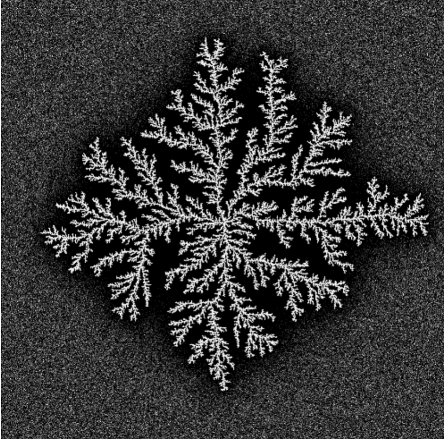

<iframe width="720" height="405" src="https://rutube.ru/play/embed/4044988bf092e351e477b7352888bef9/" frameBorder="0" allow="clipboard-write; autoplay" webkitAllowFullScreen mozallowfullscreen allowFullScreen></iframe>

<iframe width="560" height="315" src="https://plvideo.ru/embed/vIeydVQu--Je" title="Platform video player" allow="accelerometer; autoplay; clipboard-write; encrypted-media; gyroscope; picture-in-picture; web-share" referrerpolicy="strict-origin-when-cross-origin" allowfullscreen></iframe>

# Introduction

## Relevance

The appearance of dendrites plays a key role in metallurgy and in foundry production, especially during the solidification of metals and alloys, since the microstructure of the resulting dendrites largely determines the mechanical, electrical and thermal properties of the obtained materials. Studying their characteristics is important not only for a theoretical understanding of crystallization processes, but also for practice, for improving production technologies of modern materials with specified properties. 

Thus, at the second stage of the group project, an algorithm for solving the crystallization modeling problem is described. 

**Algorithm** is a systematic sequence of actions necessary to achieve a set goal. In the context of scientific research, algorithms are important not only to improve computational efficiency, but also to ensure reproducibility of results, which is a fundamental requirement of the scientific method.

## Object and subject of research

- Dendrites
- Crystalline dendrites

## Goals

To describe an algorithm for solving the problem of modeling dendrite growth.

## Tasks

- Consider an algorithm for constructing a model of dendrite growth.
- Describe the main stages of the algorithm

# Algorithm

## Step 1: Setting the parameters

At the first stage, the initial state of the system is set, which includes all the necessary physical parameters of the material and boundary conditions for simulation. Special attention is paid to the correctness of the initial data assignment, since the reliability of the entire modeling process depends on it.
### Physical properties of the substance:

- Density $\rho$: Determines the mass of a unit volume of a material and affects the thermal balance of the system. The higher the density, the more energy is required for heating.
- Specific heat of melting $L$: Characterizes the energy required for the transition of a substance from a solid phase to a liquid without changing the temperature.
- Heat capacity $cp$: Shows the amount of energy required to heat a unit of mass by one degree. It is important for calculating the dynamics of temperature changes.
- Coefficient of thermal conductivity $\kappa$: reflects the ability of a material to transfer thermal energy. Determines the rate of equalization of temperature gradients.
- Melting point $T_m$: The critical point at which the phase transition begins.
- Surface tension coefficient $\gamma$: affects the shape of the interface.
- `Anisotropy` parameters: determine the direction of preferential growth [1].

    
### Initial conditions:

- Initial melt temperature $T_∞$: Sets the degree of supercooling of the system. Determines the potential for the start of crystallization.
- Dimensionless hypothermia $S=Lcp(T_m−T_∞)​$: A key parameter indicating the thermodynamic readiness of the system to start the process.
- Boundary conditions: define the behavior of the system at the boundaries of the computational domain.
- Conditions of heat exchange with the environment [2]

## Step 2: Setting up the simulation grid

In the second step, a computational grid is created to simulate the growth of dendrites. The stage consists of preparing the mesh and the initial configuration of the crystallization seed.

### Creating a simulation grid:

- Grid size $N \times N$:
    Defines the detail of the simulation — the number of nodes on each side. More nodes give accuracy, but require more resources.
- Spatial step $h$:
    The distance between adjacent grid nodes. A smaller step increases accuracy, but increases computational costs.
## Initializing the seed:

- The central region of the solid phase:
  The initial solid zone is in the center of the grid, where dendrite growth begins. Its location affects the symmetry of the process.
- Shape and size parameters:
The shape (for example, round or elliptical) and the size of the seed set the initial conditions for growth and can affect the direction and speed of crystallization [3].
  

## Step 3: Calculation of the temperature field

The third step is to simulate the temperature distribution in the system over time. It is the basis for the analysis of dendrite growth.

### Application of the heat equation:

- The equation of thermal conductivity (1)


$$
\rho c_p \frac{\partial T}{\partial t} = \kappa \nabla^2 T
\tag{1}
$$


It is used to simulate temperature changes, takes into account the influx of heat into the system, as well as its distribution.

### Numerical implementation of the equation:

- Finite difference method: approximates derivatives in terms of discrete values;
- The choice of the time step $\Delta t$ and the spatial step $h$ is important for the stability and accuracy of calculations.

### Calculation steps:

- Calculate a new temperature distribution at each time step $\Delta t$;
- Update the temperature values at each grid point;
- Repeat calculations until a steady state or a preset time is reached.

## Step 4: Modeling Dendrite growth

At the fourth stage, modeling of dendrite growth is implemented based on calculated temperature fields and corresponding physical laws.

### The criterion of solidification:

Determine the melting point $T_m$ when the temperature at a point drops below $T_m$, it begins to solidify.

### Using Stefan's condition:

- Stefan's condition (2):


$$
V = \frac{\kappa}{\rho L} (\nabla T|_s - \nabla T|_l)
\tag{2}
$$


It determines the growth rate of the crystallization boundary $V$, which makes it possible to relate the growth rate and the difference in temperature gradients at the phase boundary.
- Taking into account the velocity $V$, the positions of the crystallization boundary are updated, simulating the expansion of the solid phase.

### Application of the Gibbs-Thomson condition:

- The Gibbs-Thomson condition (3): 


$$
T_b = T_m \left(1 - \frac{\gamma T_m}{\rho L^2 R}\right)
\tag{3}
$$


adjusts the melting point at the crystal boundary. This takes into account the influence of surface tension and the curvature of the boundary.

### Updating parameters:

After each stage of dendrite growth, the temperature field is recalculated taking into account the heat absorbed or released due to the phase transition. 

### Definition of fractal dimension

The fractal dimension $D$ describes the degree to which the structure fills the space.

The correlation function or scaling method (4) can be used for the calculation:


$$
N(r) \sim r^D
\tag{4}
$$


where $N(r)$ — the number of points inside a circle of radius $r$.

Necessary:

   - Select a set of points belonging to the formed structure
   - For different values of $r$ count the number of points inside a circle of radius.
   - Plot $\log(N(r))$ from $\log(r)$ and find the slope of a straight line — this will be the fractal dimension $D$ [4].

## Step 5: Analyzing the structure of dendrites

At this stage, the formed dendritic structures are analyzed. Their properties are evaluated and compared with theoretical and experimental data.

### Morphological analysis:

- Involves analyzing the shape and size of the dendrite, allowing you to determine the mechanisms of their growth, as well as the processes that affect it.
- The fractal dimension measurement method provides a quantitative assessment of the complexity of the dendrite structure.
 Spectral analysis examines the spatial frequencies of a structure, revealing the repeating patterns and scale of dendrite features. This helps to evaluate the regularity of branching and the overall organization of the form.

### Correlation analysis:

Evaluates the relationship between parameters (e.g. temperature and growth rate) to quantify how modeling conditions affect dendrite morphology.

### Investigation of the effects of thermal noise $\delta$

First, add thermal noise:

- Add a random disturbance to the temperature at each step $\eta_{i,j} \delta$, где $\eta_{i,j}$ — a random variable from a segment $[-1,1]$.

Since thermal noise can affect the propagation velocity of the solidification front and the shape of the dendrites, the simulation should be repeated for different values $\delta$ and compare the results, namely to evaluate how thermal noise affects:
 
- The shape of the dendrites.
- The rate of solidification.
- The fractal dimension of the formed structures.

## Step 6: Process Visualization

The sixth stage of the algorithm is the visualization of dendrite growth.

### Visualization of dendrite growth:

1. The use of graphical tools for image generation and animation illustrating the stages of dendrite formation and their final configuration [5].

2. The visual representation of the data plays a key role in interpreting the results and provides an understanding of the modeled process [6].

# Output

In the second stage of the group project, the process of creating an algorithm for modeling dendrite growth was described, which includes all key stages: from setting initial parameters and configuring the computational grid to modeling the growth process and detailed analysis of the obtained structures. 

The use of algorithms allows solving problems more efficiently and accurately, each stage makes an important contribution to the formation of a holistic understanding of the phenomenon under study.

# List of references

1. The beekeeper, Vorobyova. The Titan. Zirconium, hafnium. [electronic resource]. URL: https://en.ppt-online.org/47544.
2. D.A. Medvedev and others. Modeling of physical processes and phenomena on a PC: Textbook. Novosibirsk: Novosibirsk State University, 2010. 101 p. 
3. Calculation grid [Electronic resource]. Wikimedia Foundation, Inc., 2025. URL: https://ru.wikipedia.org/wiki/%D0%A0%D0%B0%D1%81%D1%87%D1%91%D1%82%D0%BD%D0%B0%D1%8F_%D1%81%D0%B5%D1%82%D0%BA%D0%B0.
4. Hsu Y.-R. et al. Numerical simulation of nanopost-guided self-organizationdendritic architectures using phase-field model [Electronic resource]. Wikimedia Foundation, Inc., 2018. URL: https://journals.plos.org/ploson e/article?id=10.1371/journal.pone.0199620.
5. Gif. Artificial Dendrites Growth [Electronic resource]. Wikimedia Foundation, Inc., 2025. URL: https://upload.wikimedia.org/wikipedia/commons/3/30/Artificial_dendrites_growth.gif.
6. Wang K. and others . Dendrite growth in the recharging process of zinc–air batteries [Electronic resource]. Journal of Materials Chemistry A, 2025. URL: https: //pubs.rsc.org/en/content/articlelanding/2015/ta/c5ta06366c/unauth.
