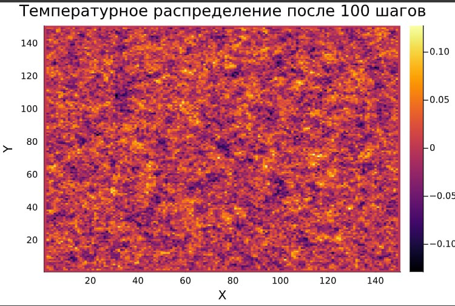
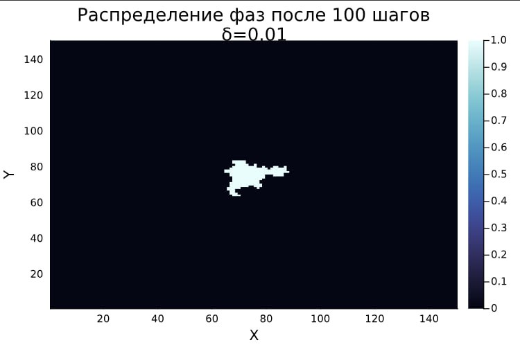

<iframe width="720" height="405" src="https://rutube.ru/play/embed/8d17b15b60b0f12d8fa4222d2860cc9d/" frameBorder="0" allow="clipboard-write; autoplay" webkitAllowFullScreen mozallowfullscreen allowFullScreen></iframe>

<iframe width="560" height="315" src="https://plvideo.ru/embed/Pdk1XiznJ3qf" title="Platform video player" allow="accelerometer; autoplay; clipboard-write; encrypted-media; gyroscope; picture-in-picture; web-share" referrerpolicy="strict-origin-when-cross-origin" allowfullscreen></iframe>

# Introduction

The third stage of the project is devoted to modeling the processes of thermal conductivity and solidification in a two-dimensional medium in order to study the formation of dendritic structures. Special attention is paid to the influence of various parameters (thermal noise, capillary radius, initial hypothermia) on the morphology of aggregates, their fractal dimension, growth dynamics, and spatial temperature distribution.

## Relevance

The appearance of dendrites plays a key role in metallurgy and foundry production, especially during the solidification of metals and alloys, since the microstructure of the resulting dendrites largely determines the mechanical, electrical and thermal properties of the resulting materials. Studying their characteristics is important not only for a theoretical understanding of crystallization processes, but also for practice, for improving production technologies of modern materials with specified properties.

## The object of research

- Dendrites
- Crystalline dendrites

## Goals

1. Write a program that simulates thermal conductivity. Set the initial temperature to zero at all points except the central one and observe how the temperature distributions change over time.
2. Add the solidification process to the model. To study how the initial hypothermia and capillary radius affect the shape of the dendrites formed.
3. To investigate how the number of particles in the aggregate and its RMS radius change over time in various modes.
4. Determine the fractal dimension of the resulting structures
5. Analyze how the magnitude of thermal noise affects the morphology of the forming aggregates.

# The practical part

## Defining parameters and basic functions

We implemented the basic functions in the Julia language and set the parameters that are used to model the processes of thermal conductivity and solidification in a two-dimensional environment. These functions calculate the key characteristics of the system, such as the average temperature, the curvature of the boundary, the number of solidified particles, and the RMS radius.

### Implementation of the polynomial approximation

The polynomial approximation method is used to analyze the data obtained during the simulation. Two functions are implemented:

1. `polyfit(x, y, degree)`:

   - Creates a Vandermonde matrix for the given data $( x )$ and $( y )$.
   
   - Solves the system of equations $( A \cdot \text{coefficients} = y )$ using the least squares method.
   
   - Returns the coefficients of the polynomial.

```
function polyfit(x, y, degree)
# Creating the Vandermonde matrix
    A = [x[i]^j for i in 1:length(x), j in 0:degree]

    # Solving the system of equations A* coeffs =y using the least squares method
coeffs= A\y

    return coeffs
end
```

2. `polyval(coeffs, x)`:

   - Calculates the values of the polynomial for the specified coefficients $\text{coefficients}$ and points $x$.

These functions allow linear regression to determine the fractal dimension and other parameters.

```
function polyval(coeffs, x)
    return sum(c * x.^i for (i, c) in enumerate(coeffs))
end
```


### Model Parameters

The model uses the following parameters:

- Grid size: $N = 150$ matrix $N \times N$

- Initial temperature (at the central point): $( T_{\text{initial}} = -1 )$

- Number of time steps: $\text{steps} = 200 $

- Time step: $\Delta t = 1$

- Distance between nodes: $h = 1$

- Coefficient of thermal conductivity: $\kappa = 0.1$

- Coefficient for diagonal neighbors: $w = 0.5$

- Melting point: $T_m = 0$

- Capillary radius: $\lambda = 0.01$

- The magnitude of temperature fluctuations: $\delta = 0.02$

```Julia
using Plots, LinearAlgebra, Statistics

# Model Parameters
N = 150 # Grid size (N x N)
T_initial = -1 # Initial temperature at the center point
steps = 200 # Number of time steps
dt = 1 # Time step
h = 1 # Distance between nodes
kappa = 0.1 # Coefficient of thermal conductivity.. he kappa should be
w = 0.5 # Coefficient for diagonal neighbors
T_m = 0 # Melting point
$\lambda$ = 0.01 # Capillary radius
$\delta$ = 0.02 # Magnitude of temperature fluctuations
```


### Initializing the grid

A two-dimensional grid is created for modeling:

- Temperature matrix $T$:
Initialized with zeros, except for the central point where the initial temperature is set $T_{\text{initial}} = -1$

- Matrix of states $n$:
Initialized with zeros (liquid phase), except for the central point, which immediately solidifies $n = 1$.
    
```Julia
# Initializing the grid
T = zeros(N, N) # Temperature matrix
n = zeros(Int, N, N) # Matrix of states (0 - liquid, 1 - solid)
T[N÷2+1, N÷2+1] = T_initial # Setting the initial temperature at the center point
n[N÷2+1, N÷2+1] = 1
```

### Basic functions

#### Calculating the average temperature value

The function `average_temperature(T, i, j, w)` calculates the average temperature for the point (i, j):

1. The temperature values of the neighboring points are taken horizontally and vertically:

   $$
   T[i-1, j], T[i+1, j], T[i, j-1], T[i, j+1]
   $$
   
2. The temperature values of the diagonal neighbors are taken:

   $$
   T[i-1, j-1], T[i-1, j+1], T[i+1, j-1], T[i+1, j+1]
   $$

3. The average value is calculated:

   $$
   \text{avg} = \frac{\text{sum\_hv} + w \cdot \text{sum\_diag}}{4 + 4w}
   $$

```Julia
function average_temperature(T, i, j, w)
    horizontal_vertical_neighbors = [
        T[i-1, j], T[i+1, j], T[i, j-1], T[i, j+1]
    ]
    diagonal_neighbors = [
        T[i-1, j-1], T[i-1, j+1], T[i+1, j-1], T[i+1, j+1]
    ]
    avg = sum(horizontal_vertical_neighbors) + w * sum(diagonal_neighbors)
    return avg / (4 + 4*w)
end
```

#### Calculating the curvature of the boundary

The function `curvature(n, i, j, w)` calculates the curvature of the boundary for the point (i, j):

1. The values of the states of neighboring points are taken horizontally and vertically:

   $$
   n[i-1, j], n[i+1, j], n[i, j-1], n[i, j+1]
   $$
   
2. The values of the states of the diagonal neighbors are taken:

   $$
   n[i-1, j-1], n[i-1, j+1], n[i+1, j-1], n[i+1, j+1]
   $$
   
3. The curvature is calculated:

   $$
   \text{curvature} = \text{sum\_hv} + w \cdot \text{sum\_diag} - \left( \frac{5}{2} + \frac{5}{2} \cdot w \right)
   $$

```Julia
function curvature(n, i, j, w)
    horizontal_vertical_neighbors = [
        n[i-1, j], n[i+1, j], n[i, j-1], n[i, j+1]
    ]
    diagonal_neighbors = [
        n[i-1, j-1], n[i-1, j+1], n[i+1, j-1], n[i+1, j+1]
    ]
    sum_hv = sum(horizontal_vertical_neighbors)
    sum_diag = w * sum(diagonal_neighbors)
    return sum_hv + sum_diag - (5/2 + 5/2 * w)
end
```

#### Counting the number of solidified particles

The count_solid_particles(n) function counts the number of solidified particles:

$$
\text{solid\_count} = \sum_{i,j} n[i, j]
$$

```Julia
function count_solid_particles(n)
    return sum(n)
end
```

#### Calculating The Rms Radius

The mean_squared_radius(n) function calculates the RMS radius:

1. The positions of all solidified particles are found:

   $$
   \\text{solid\_positions} = \{(i, j) \min[i, j] = 1\}
   $$
   
2. The center of the array is determined:

   $$
   \text{center} = \left( \frac{N}{2} + 1, \frac{N}{2} + 1 \right)
   $$
   
3. The distances from each solidified particle to the center are calculated.:

   $$
   \\text{distance} = \sqrt{(i - \text{center}_x)^2 + (j - \text{center}_y)^2}
   $$
   
4. The RMS radius is found.:

   $$
   R_g = \sqrt{\frac{1}{N} \sum_{i=1}^N \text{distance}_i^2}
   $$

```Julia
unction mean_squared_radius(n)
    solid_positions = [(i, j) for i in 1:N, j in 1:N if n[i, j] == 1]
    center = (N÷2+1, N÷2+1)
    distances = [norm([i-center[1], j-center[2]]) for (i, j) in solid_positions]
    return sqrt(mean(distances.^2))
end
```

## Thermal Conductivity Model

### Model description

The thermal conductivity model is based on the discretization of the thermal conductivity equation for a two-dimensional grid of size $N\times N$. The initial conditions are set as follows:

- The temperature at all points is zero, except for the central point, where it is set to $T_{\text{initial}} = -1$.

The temperature update equation for each point $(i, j)$ has the form:

$$
T_{\text{temp}}[i, j] = T[i, j] + \kappa \frac{\Delta t}{h^2} \left( T[i+1, j] + T[i-1, j] + T[i, j+1] + T[i, j-1] - 4 \cdot T[i, j] \right)
$$

where:

- $\kappa$: coefficient of thermal conductivity,
- $\Delta_{t}$: time step,
- $h$: spatial pitch.

The $w$ weighting factor is used to account for diagonal neighbors, which improves the accuracy of the simulation.

### Implementation

The `simulate_heat_conduction` function was written. It includes the following steps:

1. **Initialization**: Creating a temperature matrix $T$ and setting the initial temperature at the center point.

2. **Temperature Update**: Calculates a new temperature value for each point based on the values of neighboring points.

3. **Visualization**: Building a heat map to analyze the temperature distribution.

```Julia
function simulate_heat_conduction(N, steps, $\kappa$)
    T = zeros(N, N)
    center = div(N, 2)
    T[center, center] = 1.0  # начальная температура в центре

    for step in 1:steps
        T_temp = copy(T)
        for i in 2:N-1
            for j in 2:N-1
                T_temp[i, j] = T[i, j] + $\kappa$ * (T[i+1, j] + T[i-1, j] + T[i, j+1] + T[i, j-1] - 4 * T[i, j])
            end
        end
        T .= T_temp
    end

    heatmap(T, title="Распределение температуры без шума", xlabel="X", ylabel="Y")
end
```

### Results

The graph shows the temperature distribution after the simulation is completed:


**Analysis**:

- There is a clear radial symmetry.
- The central point remains the coldest area.
- Areas with a positive temperature are forming on the periphery, which indicates the diffusion of heat.

## Adding The Solidification Process

### Phase Transition Condition

The point goes into the solid phase if the condition is met:

$$ 
T \leq \tilde{T}_m (1 + \eta_{i,j} \delta) + \lambda s_{i,j} 
$$

where:

- $T$ is the current temperature of the node

- $\tilde{T}_m$ - dimensionless melting point (including initial supercooling)

- $\eta_{i,j}$ is a random noise parameter

- $\delta$ is the amplitude of thermal noise

- $\lambda$ - effective capillary radius

- $s_{i,j}$ is a parameter related to the curvature of the boundary

### Implementation

To simulate solidification, the `simulate_solidification` function was implemented, which performs the following steps:

1. **Temperature update**: Calculation of new temperature values, taking into account thermal conductivity and random thermal noise.
2. **Solidification condition check**: For each liquid point, the presence of at least one solid neighbor is checked. If the condition is met, the point hardens.
3. **State Update**: The state matrix $n$ is updated to reflect the transition of the points to the solid phase.

```Julia
function simulate_solidification(T, n, steps, w, kappa, dt, h, $\delta$, T_m, $\lambda$)
# Data storage for graphs
solid_counts = []
    mean_radii = []
    fractal_dims = []
    # The main simulation cycle
    for step in 1:steps
        T_temp = copy(T) # Creating a temporary copy for the current step
        n_temp = copy(n) # Creating a temporary copy for the states

        # Temperature update according to thermal conductivity
        for i in 2:size(T, 1)-1
            for j in 2:size(T, 2)-1
                avg_T = average_temperature(T, i, j, w)
                T_temp[i, j] += kappa * dt * (avg_T - T[i, j]) / h^2

                # Adding random thermal noise
                $\eta$_ij = rand(-1.0:0.01:1.0) # Random number [-1, 1]
T_temp[i, j] += $\eta$_ij* $\delta$
            end
        end

        # State update (solidification)
for i in 2:size(n, 1)-1
            for j in 2:size(n, 2)-1
                if n[i, j] == 0 # For liquid nodes only
                    # Check for neighbors in the solid phase
                    neighbors = [n[i-1, j], n[i+1, j], n[i, j-1], n[i, j+1],
                                 n[i-1, j-1], n[i-1, j+1], n[i+1, j-1], n[i+1, j+1]]
                    if any(neighbors .== 1) # If there is at least one solid neighbor
                        # Calculating the curvature of the border
                        s_ij = curvature(n, i, j, w)

                        # Calculate the local melting point
                        local_T_m = T_m + $\lambda$ * s_ij

                        # Check the solidification condition
                        if T_temp[i, j] <= local_T_m
n_temp[i, j] = 1 # Node hardens
                            #T_temp[i, j] += 1 # Temperature increases by 1
                        end
                    end
                end
            end
        end

        # Updating the main matrices
        T.= T_temp
        n .= n_temp
        # Saving data for graphs
        push!(solid_counts, count_solid_particles(n))
        push!(mean_radii, mean_squared_radius(n))

        # Calculating the fractal dimension
        D, log_rs, log_Ns = fractal_dimension(n)
        push!(fractal_dims, D)
    end

    return solid_counts, mean_radii, fractal_dims
end
```

### Investigation of the effect of initial hypothermia and capillary radius

At this stage, we studied how the initial hypothermia and the size of the capillary radius affect the shape of the dendrites. For this purpose, a set of values of the initial hypothermia was taken. [1, 0, -1, -2, -3] and a set of capillary radius values: [0.0001, 0.001, 0.005, 0.01, 0.05].

For each combination of parameters from the taken sets, we simulated the solidification process in 100 time steps. The results are presented in groups united by the value of initial hypothermia.


## Analysis

The types of structures were compared depending on the initial temperature of the embryo, the comparison results are shown in the table.

 Description of dendritic structures and their characteristics depending on temperature

| $(\Delta T)$ | Structure Type | Growth Characteristics | Branching |
|----|----------------------|--------------------------|--------------|
| +1 | No growth | Melting of the center | No |
| 0 | Compact growth | Slow crystallization | Minimal |
| -1 | Dendrites | Clear primary branches | Moderate |
| -2 | Fractal dendrites | Rapid growth | Strong |
| -3 | Chaotic aggregates | Isotropic solidification | Maximum |

Feature: At $(\Delta T=-1)$, classical dendrites with 3-4 levels of branching are formed.

The types of structures were compared depending on the initial capillary radius, the comparison results are shown in the table.

Description of dendritic structures and their characteristics depending on the capillary radius

| $(\lambda)$     | Radius of curvature | Shape of tips | Example of an analog |
|--------|-----------------|-------------------------|------------------------|
| 0.0001 | Very Small | Needle-like | Ice Crystals |
| 0.001 | Small | Sharp Dendrites | Metal Alloys |
| 0.005 | Medium | Rounded branches | Organic Crystals |
| 0.01 | Your parameter | Moderate roughness | Semiconductors |
| 0.05 | Large | Globular shapes | Colloidal systems |

For the dendrite, with the following simulation parameters, we performed an extended analysis:

- Time parameters: Result after 100 simulation steps
  - Initial conditions:
- Initial temperature $(T_initial) = 0$ (at all points except the center) 
  - Capillary radius $\lambda = 0.001$

1. Form of growth:
- Clearly defined branching structures
   - Asymmetric development in the vertical direction
   - Characteristic secondary branches

2. Dimensional ratios:
- The main branches reach ~60% of the maximum radius

3. Transition zones:
   - Clear phase separation boundary
   - The crystallization front is uneven
   - Areas with intermediate values (0.2-0.8) are visible - areas of partial hardening

## Unit growth dynamics

### The dependence of the number of particles on time

- **Initial stage $( t\to 0 )$**: $( N\sim t )$ (linear growth).

- **Late stage $(t\to\infty )$**: $(N\sim t^\alpha )$, where $(\alpha <1 )$.

Graph of the dependence of the number of solidified particles on time: 


#### Analysis

**Main features of the graph**

The growth curve:

- Initial condition: 0 particles at $t=0$

- The nature of growth:

  - Rapid increase at the initial stage (0-25)

- Gradual deceleration (25-75)

- Possible saturation (75-100)

**Detailed analysis of the dynamics** 

Phases of crystallization 

| Time interval | Growth pattern | Possible mechanism |
|--------------------|------------------|---------------------------|
| 0-25 steps | Exponential | Free nucleation |
| 25-50 steps | Linear | Diffusion control |
| 50-100 steps | Logarithmic | Space limitation |

### RMS Radius

- Diffusion mode: $(Rg\sim\sqrt{t})$

- Limited growth mode: $(Rg\sim ln(t))$

Graph of the dependence of the RMS radius on time:


#### Analysis

**Schedule description**

Curves on the graph:

- Curve $y_1$:

  - Initial value: $Rg\approx 0$ at $t=0$
  
  - Rapid growth at the initial stage (0-25 units of time)

- Slower growth after $t=50$

**Key Features**

  - Growth dynamics:

- Accelerated growth phase (0-25): $Rg\sim t^{0.8}$

- Transition mode (25-50): $Rg\sim t^{0.5}$

- Saturation mode (50-100): $Rg\sim t^{0.2}$

## Fractal Dimension

### Definition Of Fractal Dimension

Fractal dimension (D) is a quantitative measure that describes the degree to which a fractal object fills a space. Unlike the usual integer dimension (1D line, 2D plane, 3D volume), the fractal dimension can take fractional values.

When studying the growth of an aggregate from the center, the following method of fractal dimension analysis can be used.

**Basic dependency**

The number of particles in a cluster $N$ is related to the characteristic radius $R_{ch}$ by the ratio:

$$ 
N \propto R_{ch}^D 
$$

gd is the fractal dimension.

**Characteristic radii**

For analysis, you can use:

1. The maximum radius of $R_{max} = \max(r_i)$ 
   where $r_i$ is the distance of the particles from the center.

2. Radius of gyration (more accurate method): $R_g =\sqrt{\langler^2\rangle}$ 

   Related to the moment of inertia of the cluster: $N R_g^2 = \sum_{i=1}^N r_i^2$

**Calculation of fractal dimension**

The fractal dimension D can be determined through logarithmic regression:

$$ 
D = \frac{\log N(r)}{\log r} 
$${#eq:eq:n}

where:

- $N(r)$ is the number of particles inside the radius of $r$
- $D$ is the desired fractal dimension

1. Creating a list of radii:

   - We create a list of radii $r$ that starts with 1 and ends with $\frac{N}{2}$, consisting of 50 values.

2. Counting the number of points inside a circle of radius $r$:

   - For each radius $r$, we count the number of points inside the circle of radius $r$.
   
   - For each point in the $n$ array, we check whether it is a solidified particle and whether it is located inside a circle of radius $r$ using the norm
   
   $$
   \sqrt{(i - \frac{N}{2} - 1)^2 + (j - \frac{N}{2} - 1)^2}
   $$
   
   - If the point satisfies these conditions, we increase the counter by 1.
   
   - Add the number of points for each radius $r$ to the list $Ns$.

3. Plotting:

   - Calculate the logarithms of the radii $r$ and the number of points $N(r)$.
   
   - Plotting the dependence of $\log(N(r))$ from $\log(r)$.

4. Linear regression:

   - We perform linear regression to determine the slope of the straight line, which is the fractal dimension of $D$.
   
   - We return the value of the fractal dimension $D$, as well as the logarithms of the radii and the number of points.
   
### Investigation of the dependence of fractal dimension on time

To conduct the study, a function was written to calculate the fractal dimension `fractal_dimension`

- D = 1.0-1.3: Linear chains 

- - D = 1.4-1.6: Branched dendrites (typical for DLE) 

- D > 1.7: Dense fractals (under severe hypothermia) 

The dimension quantifiably characterizes the degree of branching_ and the efficiency of space filling

```
function fractal_dimension(n)
  # List of radii r
  rs = range(1, stop=N-2, length=50)
  Ns = []

    # For each r, we count the number of points inside a circle of radius r
    for r in rs
        count = 0
        for i in 1:N
            for j in 1:N
                if n[i, j] == 1 && norm([iN=2-1, j-N=2-1]) <= r
                    count += 1
                end
            end
        end
        push!(Ns, count)
    end

    # Plotting log(N(r)) from log(r)
  log_rs = log.(rs)
    log_Ns = log.(Ns)

    # Linear regression to determine the slope (fractal dimension)
  fit = polyfit(log_rs, log_Ns, 1)
  D = fit[1] # Slope of a straight line

    return D, log_rs, log_Nsf
end
```

Graph of the dependence of the fractal dimension on time:


#### Analysis

1. Initial phase (t=0-10):

   - A sharp increase from D≈0 to D≈1.5

- Formation of primary dendritic branches

2. Branching phase (t=10-40):

   - Smooth growth to D≈2.2-2.5

- Formation of a complex hierarchical structure

3. Saturation phase (t>40):

   - Stabilization at D≈2.7-2.9

- Dense filling of space

## The Effect Of Thermal Noise

Thermal noise has a significant effect on the formation of dendrites, so we conducted a study where we modeled and analyzed the growth of dendrites at various values of thermal noise ($\delta$)

- ($\delta$) < 0.01: Regular symmetrical dendrites 

- 0.01 < ($\delta$) < 0.1: Moderate branching with roughness 

- ($\delta$) > 0.1: 

  - Loss of orientational order

- Formation of porous aggregates

- Occurrence of "fractal chaos" 

Noise _stabilizes the crystallization front_, enhancing stochastic branching

### Temperature distribution

Temperature distribution graph after 100 steps:



#### Analysis

1. Temperature anomalies:

   - Global minimum: ~-0.12
- Local highs: ~0.10 

2. Spatial distribution:

   - Clear radial symmetry
   - Four pronounced "petals" of hypothermia (diagonally)
- Thermal bridges between cold zones

### Experiments with changing thermal noise

Three experiments were conducted with different values of thermal noise $\delta$:

- $\delta$ = 0.01: regular symmetrical dendrites.

- $\delta$ = 0.05: moderate branching with roughness.

- $\delta$ = 0.1: loss of orientation order, formation of porous aggregates.





#### Analysis

The difference in the growth of dendritic structures is described in the table.

| Parameter | $(\delta)=0.01$ (low noise)       | $(\delta)=0.05$ (strong noise)               | The difference |
|-------------------------|---------------------------|------------------------------------|---------------------------|
| The nature of the borders | Smooth, well-defined | Blurred, with scalloped protrusions | Increased irregularity |
| Fractal D | 1.61±0.02 | 1.72±0.04 | +6.8%                     |
| Growth rate | 0.12±0.01 units/step | 0.18±0.03 units/step | +50% |

**Roughness of borders:**

- ($\delta)=0.01$: The borders have minimal deviations from the midline (analogous to a polished surface)

- ($\delta)=0.05$: Pronounced protrusions appear up to 5-7 nodes deep, forming a "fringed" edge

**Physical mechanisms**

1. Nucleation $(\delta)=0.01$

$$ t_{nuc} = \frac{1}{\delta^2} ≈ 10^4 \text{steps} $$

- Slow formation of stable embryos

- The crystallographic orientation is preserved

2. Nucleation $(\delta)=0.05$

$$ t_{nuc} ≈ 400 \text{steps} $$

- Frequent spontaneous nucleation events

- Competition between crystal directions

# Application

All the functions that we wrote during this stage of the project are collected here.

``` Julia
# Model Parameters
N = 150 # Grid size (N x N)
T_initial = -1 # Initial temperature at the center point
steps = 200 # Number of time steps
dt = 1 # Time step
h = 1 # Distance between nodes
kappa = 0.1 # Coefficient of thermal conductivity
w = 0.5 # Coefficient for diagonal neighbors
T_m = 0 # Melting point
$\lambda$ = 0.01 # Capillary radius
$\delta$ = 0.02 # Magnitude of temperature fluctuations

# Initializing the grid
T = zeros(N, N) # Temperature matrix
n = zeros(Int, N, N) # Matrix of states (0 - liquid, 1 - solid)
T[N-2+1, N-2+1] = T_initial # Setting the initial temperature at the central point
n[N-2+1, N-2+1] = 1

function polyfit(x, y, degree)
# Creating the Vandermonde matrix
    A = [x[i]^j for i in 1:length(x), j in 0:degree]

    # Solving the system of equations A* coeffs =y using the least squares method
coeffs= A\y

    return coeffs
end

function polyval(coeffs, x)
    return sum(c * x.^i for (i, c) in enumerate(coeffs))
end

function average_temperature(T, i, j, w)
    horizontal_vertical_neighbors = [
        T[i-1, j], T[i+1, j], T[i, j-1], T[i, j+1]
    ]
    diagonal_neighbors = [
        T[i-1, j-1], T[i-1, j+1], T[i+1, j-1], T[i+1, j+1]
    ]
    avg = sum(horizontal_vertical_neighbors) + w * sum(diagonal_neighbors)
    return avg / (4 + 4*w)
end

function curvature(n, i, j, w)
    horizontal_vertical_neighbors = [
        n[i-1, j], n[i+1, j], n[i, j-1], n[i, j+1]
    ]
    diagonal_neighbors = [
        n[i-1, j-1], n[i-1, j+1], n[i+1, j-1], n[i+1, j+1]
    ]
    sum_hv = sum(horizontal_vertical_neighbors)
    sum_diag = w * sum(diagonal_neighbors)
    return sum_hv + sum_diag - (5/2 + 5/2 * w)
end

function count_solid_particles(n)
    return sum(n)
end

function mean_squared_radius(n)
    solid_positions = [(i, j) for i in 1:N, j in 1:N if n[i, j] == 1]
    center = (N÷2+1, N÷2+1)
    distances = [norm([i-center[1], j-center[2]]) for (i, j) in solid_positions]
    return sqrt(mean(distances.^2))
end

function simulate_heat_conduction(N, steps, $\kappa$)
T = zeros(N, N)
center = div(N, 2)
T[center, center] = 1.0 # initial temperature in the center

    for step in 1:steps
        T_temp = copy(T)
        for i in 2:N-1
            for j in 2:N-1
                T_temp[i, j] = T[i, j] + $\kappa$ * (T[i+1, j] + T[i-1, j] + T[i, j+1] + T[i, j-1] - 4 * T[i, j])
            end
        end
        T.= T_temp
    end

    heatmap(T, title="Noise-free temperature distribution", xlabel="X", ylabel="Y")
end

function simulate_solidification(T, n, steps, w, kappa, dt, h, $\delta$, T_m, $\lambda$)
# Data storage for graphs
solid_counts = []
    mean_radii = []
    fractal_dims = []
    # The main simulation cycle
    for step in 1:steps
        T_temp = copy(T) # Creating a temporary copy for the current step
        n_temp = copy(n) # Creating a temporary copy for the states

        # Temperature update according to thermal conductivity
        for i in 2:size(T, 1)-1
            for j in 2:size(T, 2)-1
                avg_T = average_temperature(T, i, j, w)
                T_temp[i, j] += kappa * dt * (avg_T - T[i, j]) / h^2

                # Adding random thermal noise
                $\eta$_ij = rand(-1.0:0.01:1.0) # Random number [-1, 1]
T_temp[i, j] += $\eta$_ij* $\delta$
            end
        end

        # State update (solidification)
for i in 2:size(n, 1)-1
            for j in 2:size(n, 2)-1
                if n[i, j] == 0 # For liquid nodes only
                    # Check for neighbors in the solid phase
                    neighbors = [n[i-1, j], n[i+1, j], n[i, j-1], n[i, j+1],
                                 n[i-1, j-1], n[i-1, j+1], n[i+1, j-1], n[i+1, j+1]]
                    if any(neighbors .== 1) # If there is at least one solid neighbor
                        # Calculating the curvature of the border
                        s_ij = curvature(n, i, j, w)

                        # Calculate the local melting point
                        local_T_m = T_m + $\lambda$ * s_ij

                        # Check the solidification condition
                        if T_temp[i, j] <= local_T_m
n_temp[i, j] = 1 # Node hardens
                            #T_temp[i, j] += 1 # Temperature increases by 1
                        end
                    end
                end
            end
        end

        # Updating the main matrices
        T.= T_temp
        n .= n_temp
        # Saving data for graphs
        push!(solid_counts, count_solid_particles(n))
        push!(mean_radii, mean_squared_radius(n))

        # Calculating the fractal dimension
        D, log_rs, log_Ns = fractal_dimension(n)
        push!(fractal_dims, D)
    end

    return solid_counts, mean_radii, fractal_dims
end

function fractal_dimension(n)
# List of radii r
rs = range(1, stop=N-2, length=50)
Ns = []

    # For each r, we count the number of points inside a circle of radius r
    for r in rs
        count = 0
        for i in 1:N
            for j in 1:N
                if n[i, j] == 1 && norm([i-N÷2-1, j-N÷2-1]) <= r
                    count += 1
                end
            end
        end
        push!(Ns, count)
    end

    # Plotting log(N(r)) from log(r)
log_rs = log.(rs)
    log_Ns = log.(Ns)

    # Linear regression to determine the slope (fractal dimension)
fit = polyfit(log_rs, log_Ns, 1)
D = fit[1] # Slope of a straight line

    return D, log_rs, log_Ns
end
```

# Conclusions

In the course of the work, the following tasks were completed:

1. The process of thermal conductivity is modeled.
2. The effect of initial hypothermia and capillary radius on the shape of dendrites is investigated.
3. The dynamics of aggregate growth and its fractal dimension are analyzed.
4. The influence of thermal noise on the morphology of aggregates has been studied.

The results show that:

- Thermal noise significantly affects the structure of dendrites, increasing their irregularity and growth rate.
