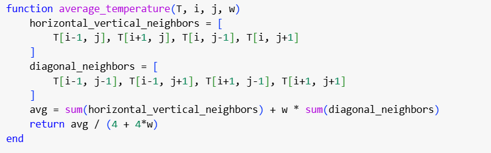
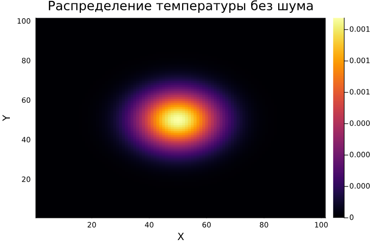

<iframe width="720" height="405" src="https://rutube.ru/play/embed/8d17b15b60b0f12d8fa4222d2860cc9d/" frameBorder="0" allow="clipboard-write; autoplay" webkitAllowFullScreen mozallowfullscreen allowFullScreen></iframe>

<iframe width="560" height="315" src="https://plvideo.ru/embed/Pdk1XiznJ3qf" title="Platform video player" allow="accelerometer; autoplay; clipboard-write; encrypted-media; gyroscope; picture-in-picture; web-share" referrerpolicy="strict-origin-when-cross-origin" allowfullscreen></iframe>

## Актуальность

Появление дендритов играет ключевую роль в металлургии и литейном производстве, особенно при затвердевании металлов и сплавов, поскольку микроструктура образующихся дендритов во многом определяет механические, электрические и термические свойства получаемых материалов. Изучение их характеристик важно не только для теоретического понимания процессов кристаллизации, но и для практики, для совершенствования технологий производства современных материалов с заданными свойствами.

## Объект и предмет исследования

- Дендриты, 
- Кристаллические дендриты

## Цели и задачи

1. Написать программу, моделирующую теплопроводность. Задать начальную температуру равную нулю во всех точках, кроме центральной и пронаблюдать, как изменятся распределения температуры со временем.
2. Добавить в модель процесс затвердевания. Изучить, как начальное переохлаждение и капиллярный радиус влияют на форму образующихся дендритов.
3. Исследовать, как со временем изменяются количество частиц в агрегате и его среднеквадратичный радиус в различных режимах.
4. Определить фрактальную размерность полученных структур
5. Проанализировать, как величина теплового шума влияет на морфологию формирующихся агрегатов.


# Выполнение задач третьего этапа

## Задание базовых параметров моделирования

```Julia
N = 150          # Размер сетки (N x N)
T_initial = -1 # Начальная температура в центральной точке
steps = 200     # Количество временных шагов
dt = 1          # Шаг по времени
h = 1           # Расстояние между узлами
kappa = 0.1         # Коэффициент теплопроводности
w = 0.5         # Коэффициент для диагональных соседей
T_m = 0         # Температура плавления
lambda = 0.01         # Капиллярный радиус
delta = 0.02        # Величина флуктуаций температуры
```

## Инициализация сетки

```Julia
T = zeros(N, N)            # Матрица температур
n = zeros(Int, N, N)       # Матрица состояний (0 - жидкое, 1 - твердое)
T[N÷2+1, N÷2+1] = T_initial  # Установка начальной температуры в центральной точке
n[N÷2+1, N÷2+1] = 1
```

## Базовые функции

  - Метод полиномиальной аппроксимации
  - Среднее значение температуры
  - Кривизна границы
  - Количества затвердевших частиц 
  - Среднеквадратичный радиус 



## Базовые функции

  - Метод полиномиальной аппроксимации
  - Среднее значение температуры
  - Кривизна границы
  - Количества затвердевших частиц 
  - Среднеквадратичный радиус 


## Базовые функции

  - Метод полиномиальной аппроксимации
  - Среднее значение температуры
  - Кривизна границы
  - Количества затвердевших частиц 
  - Среднеквадратичный радиус 
  


## Модель теплопроводности



Функция `simulate_heat_conduction` на основе уравнения обновления температуры:


## Добавление процесса затвердевания

Реализована функция `simulate_solidification`, которая выполняет следующие шаги:

1. Обновление температур
2. Проверка условия затвердевания
3. Обновление состояний


## Результаты моделирования. Исследование влияния капиллярного радиуса


## Динамика роста агрегата


## Фрактальная размерность


Фрактальную размерность $D$ можно определить через логарифмическую регрессию:

$$ 
D = \frac{\log N(r)}{\log r} 
$$

где:

- $N(r)$ - количество частиц внутри радиуса $r$
- $D$ - искомая фрактальная размерность

Реализована функция `fractal_dimension`

## Влияние теплового шума


## Выводы

1. Смоделирован процесс теплопроводности.
2. Исследовано влияние начального переохлаждения и капиллярного радиуса на форму дендритов.
3. Проанализирована динамика роста агрегата и его фрактальная размерность.
4. Изучено влияние теплового шума на морфологию агрегатов.

Результаты показывают, что:

- Тепловой шум значительно влияет на структуру дендритов, увеличивая их нерегулярность и скорость роста.

