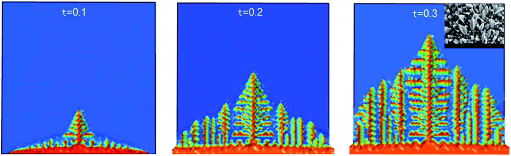

Наша исследовательская команда работает над проектом по теме "Рост дендритов", в котором мы исследуем математическую модель этого процесса, а также алгоритмы решения этой задачи. 

<!--more-->

## Общая информация
Наша исследовательская группа работает над проектом "Рост дендритов", в рамках которого мы исследуем математическую модель этого процесса.

Ссылка на общую информацию со всеми материалами по второму этапу проекта: https://aachemodanova.github.io/dendrites_group_research/ru/publication/second_stage/

Ссылка на мероприятие с презентациями по второму этапу проекта: https://aachemodanova.github.io/dendrites_group_research/ru/event/second_stage/

## Актуальность
Появление дендритов играет ключевую роль в металлургии и литейном производстве, особенно при затвердевании металлов и сплавов, поскольку микроструктура образующихся дендритов во многом определяет механические, электрические и термические свойства получаемых материалов. Изучение их характеристик важно не только для теоретического понимания процессов кристаллизации, но и для практики, для совершенствования технологий производства современных материалов с заданными свойствами. 
Таким образом, на втором этапе группового проекта описывается алгоритм решения задачи моделирования кристаллизации. 

**Алгоритм** - систематизированная последовательность действий, необходимых для достижения поставленной цели. В контексте научных исследований алгоритмы важны не только для повышения эффективности вычислений, но и для обеспечения воспроизводимости результатов, что является фундаментальным требованием научного метода.

## Объект и предмет исследования
- Дендриты, 
- Кристаллические дендриты

## Цели

Описать алгоритм решения задачи моделирования роста дендритов.

## Задачи

- Рассмотреть алгоритм построения модели роста дендритов.
- Описать основные этапы алгоритма

## Определение

Дендрит - это кристалл, который развивается с типичной формой разветвления, напоминающей фрактал.  В металлах они образуются в процессе кристаллизации из переохлажденного расплава.

# Алгоритм

## Шаг 1: Задание параметров
- Физические свойства вещества
- Начальные условия

## Шаг 2: Настройка симуляционной сетки

- Создание симуляционной сетки.
- Инициализация затравки.

## Шаг 3: Расчет температурного поля

- Применение уравнения теплопроводности
- Вычислить новое распределение температуры на каждом шаге времени $\Delta t$
- Обновлять значения температуры в каждой точке сетки
- Повторять вычисления до достижения стационарного состояния или заданного времени.

## Шаг 4: Моделирование роста дендритов

- Критерий затвердевания
- Использование условия Стефана
- Применение условия Гиббса-Томсона
- Обновление параметров
- Определение фрактальной размерности

## Шаг 5: Анализ структуры дендритов
- Морфологический анализ
- Корреляционный анализ
- Исследование влияния теплового шума $\delta$

## Шаг 6: Визуализация процесса

## Выводы
Завершен второй этап группового проекта по теме "Рост дендритов", в результате  был описан процесс создания алгоритма для моделирования роста дендритов, включающий все ключевые этапы: от задания начальных параметров и настройки расчетной сетки до моделирования процесса роста и детального анализа полученных структур. 

## Результат
Завершен первый этап группового проекта по теме "Рост дендритов", в результате которого мы изучили материалы по научной проблеме, составили теоретическое описание модели роста дендритов и определили задачи дальнейших исследований.

# Смотрите также

## Материалы первого этапа

Ссылка на общую информацию со всеми материалами по первому этапу проекта: https://aachemodanova.github.io/dendrites_group_research/ru/publication/first_stage/

Ссылка на мероприятие с презентациями по первому этапу проекта: https://aachemodanova.github.io/dendrites_group_research/ru/event/first_stage/
