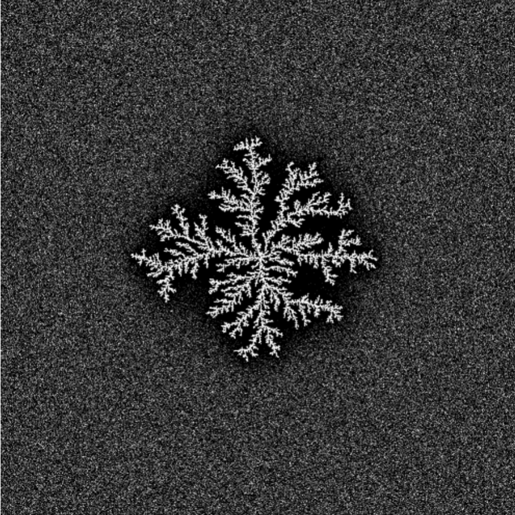

<iframe width="720" height="405" src="https://rutube.ru/play/embed/4044988bf092e351e477b7352888bef9/" frameBorder="0" allow="clipboard-write; autoplay" webkitAllowFullScreen mozallowfullscreen allowFullScreen></iframe>

<iframe width="560" height="315" src="https://plvideo.ru/embed/vIeydVQu--Je" title="Platform video player" allow="accelerometer; autoplay; clipboard-write; encrypted-media; gyroscope; picture-in-picture; web-share" referrerpolicy="strict-origin-when-cross-origin" allowfullscreen></iframe>

# Введение

На втором этапе группового проекта описывается алгоритм решения задачи моделирования кристаллизации. 

**Алгоритм** - систематизированная последовательность действий, необходимых для достижения поставленной цели. В контексте научных исследований алгоритмы важны не только для повышения эффективности вычислений, но и для обеспечения воспроизводимости результатов, что является фундаментальным требованием научного метода.

## Объект и предмет исследования

- Дендриты
- Кристаллические дендриты

## Цели

Описать алгоритм решения задачи моделирования роста дендритов.

## Задачи

- Рассмотреть алгоритм построения модели роста дендритов.
- Описать основные этапы алгоритма

# Алгоритм

## Шаг 1: Описание алгоритма

На первом этапе задается начальное состояние системы, которое включает в себя все необходимые физические параметры материала и граничные условия для симуляции. Особое внимание уделяется корректности задания исходных данных, так как от этого зависит достоверность всего процесса моделирования.

### Физические свойства вещества:

- Плотность $\rho$: Определяет массу единицы объема материала и влияет на тепловой баланс системы. Чем выше плотность, тем больше энергии требуется для нагрева.
- Удельная теплота плавления $L$: Характеризует энергию, необходимую для перехода вещества из твердой фазы в жидкую без изменения температуры.
- Теплоемкость $cp$: Показывает количество энергии, требуемое для нагрева единицы массы на один градус. Важна для расчета динамики изменения температуры.
- Коэффициент теплопроводности $\kappa$: отражает способность материала передавать тепловую энергию. Определяет скорость выравнивания температурных градиентов.
- Температура плавления $T_m​$: Критическая точка, при которой начинается фазовый переход.
- Коэффициент поверхностного натяжения $\gamma$: влияет на форму границы раздела фаз.
- Параметры `анизотропии`: определяют направление преимущественного роста [1].

    
### Начальные условия:

- Исходная температура расплава $T_∞​$: Задает степень переохлаждения системы. Определяет потенциал для начала кристаллизации.
- Безразмерное переохлаждение $S=Lcp​(T_m​−T_∞​)​$: Ключевой параметр, показывающий термодинамическую готовность системы к началу процесса.
- Граничные условия: задают поведение системы на границах расчетной области.
- Условия теплообмена с окружающей средой [2]

## Шаг 2: Настройка симуляционной сетки

На втором шаге создается расчетная сетка для моделирования роста дендритов. Этап состоит из подготовки сетки и начальной конфигурации затравки кристаллизации.

### Создание симуляционной сетки:

- Размер сетки $N \times N$:
    Определяет детализацию моделирования — количество узлов по каждой стороне. Больше узлов дают точность, но требуют больше ресурсов.
- Пространственный шаг $h$:
    Расстояние между соседними узлами сетки. Меньший шаг повышает точность, но увеличивает вычислительные затраты.

### Инициализация затравки:

- Центральная область твердой фазы:
  Начальная твердая зона в центре сетки, откуда начинается рост дендритов. Её расположение влияет на симметрию процесса.
- Параметры формы и размеров:
  Форма (например, круглая или эллиптическая) и размер затравки задают начальные условия для роста и могут влиять на направление и скорость кристаллизации [3].
  

## Шаг 3: Расчет температурного поля

Третий шаг представляет собой моделирование распределения температуры в системе с течением времени. Оно является основой для анализа роста дендритов.

### Применение уравнения теплопроводности:

- Уравнение теплопроводности (1)


$$
\rho c_p \frac{\partial T}{\partial t} = \kappa \nabla^2 T
\tag{1}
$$


Оно используется для моделирования изменений температуры, учитывает приток тепла в систему, а также его распределение.

### Численная реализация уравнения:

- Метод конечных разностей: аппроксимирует производные через дискретные значения;
- Выбор временного шага $\Delta t$ и пространственного шага $h$ важен для стабильности и точности расчетов.

### Шаги алгоритма:

- Вычислить новое распределение температуры на каждом шаге времени $\Delta t$;
- Обновлять значения температуры в каждой точке сетки;
- Повторять вычисления до достижения стационарного состояния или заданного времени.

## Шаг 4: Моделирование роста дендритов

На четвертом этапе реализуется моделирование роста дендритов, основываясь на рассчитанных температурных полях и соответствующих физических законах.

### Критерий затвердевания:

Определить температуру плавления $T$ когда температура в точке падает ниже $T_m$, она начинает затвердевать.

### Использование условия Стефана:

- Условие Стефана (2):


$$
V = \frac{\kappa}{\rho L} (\nabla T|_s - \nabla T|_l)
\tag{2}
$$


Оно определяет скорость роста границы кристаллизации $V$, что позволяет связать скорость роста и разницу градиентов температуры на границе фаз.
- Учитывая скорость $V$, обновляются положения границы кристаллизации, моделируя расширение твердой фазы.

### Применение условия Гиббса-Томсона:

- Условие Гиббса-Томсона (3): 


$$
T_b = T_m \left(1 - \frac{\gamma T_m}{\rho L^2 R}\right)
\tag{3}
$$


корректирует температуру плавления на границе кристалла. При этом учитываются влияние поверхностного натяжения и кривизна границы.

### Обновление параметров:

После каждого этапа роста дендритов температурное поле пересчитывается с учетом теплоты, поглощенной или выделившейся за счет фазового перехода. 

### Определение фрактальной размерности

Фрактальная размерность $D$ описывает степень заполнения пространства структурой.
Для расчета можно использовать метод корреляционной функции или масштабирования (4):


$$
N(r) \sim r^D
\tag{4}
$$


где $N(r)$ — число точек внутри круга радиуса $r$.

Необходимо:

   - Выбрать множество точек, принадлежащих образованной структуре 
   - Для разных значений $r$ подсчитать количество точек внутри круга радиуса.
   - Построить график $\log(N(r))$ от $\log(r)$ и найти наклон прямой — это будет фрактальная размерность $D$ [4].

## Шаг 5: Анализ структуры дендритов

На данном этапе анализируются сформированные дендритные структуры. Их свойства оцениваются и сравниваются с теоретическими и экспериментальными данными.

### Морфологический анализ:

- Предполагает анализ формы и размеров дендрита, позволяя определить механизмы их роста, а также влияющие на это процессы.
- Метод измерения фрактальной размерности дает количественную оценку сложности структуры дендритов.
- Спектральный анализ исследует пространственные частоты структуры, выявляя повторяющиеся паттерны и масштаб особенностей дендритов. Это помогает оценить регулярность ветвления и общую организацию формы.

### Корреляционный анализ:

Оценивает связь между параметрами (например, температурой и скоростью роста), чтобы количественно определить, как условия моделирования влияют на морфологию дендритов.

### Исследование влияния теплового шума $\delta$

Сначала добавим тепловой шум:

- На каждый шаг добавлять случайное возмущение к температуре $\eta_{i,j} \delta$, где $\eta_{i,j}$ — случайная величина из отрезка $[-1,1]$.

 Так как тепловой шум может влиять на скорость распространения фронта затвердевания и форму дендритов, следует повторить моделирование для разных значений $\delta$ и сравнить результаты, а именно оценить, как тепловой шум влияет на:
 
- Форму дендритов.
- Скорость затвердевания.
- Фрактальную размерность образованных структур.

## Шаг 6: Визуализация процесса

Шестой этап алгоритма представляет собой визуализацию роста дендритов.

### Визуализация роста дендритов:

1. Применение графических средств для генерации изображений и анимации, иллюстрирующих этапы формирования дендритов и их окончательную конфигурацию [5].

2. Визуальное представление данных играет ключевую роль в интерпретации результатов и обеспечивает понимание моделируемого процесса [6].

# Вывод

Во втором этапе группового проекта был описан процесс создания алгоритма для моделирования роста дендритов, включающий все ключевые этапы: от задания начальных параметров и настройки расчетной сетки до моделирования процесса роста и детального анализа полученных структур. 

Использование алгоритмов позволяет решать задачи более эффективно и точно, каждый этап вносит важный вклад в формирование целостного понимания исследуемого явления.

# Список литературы

1. Пасечник, Воробьева. Титан. Цирконий, гафний. [Электронный ресурс]. URL: https://en.ppt-online.org/47544.
2. Медведев Д.А. и др. Моделирование физических процессов и явлений на ПК: Учеб. пособие. Новосибирск: Новосиб. гос. ун-т., 2010. 101 с. 
3. Расчётная сетка [Электронный ресурс]. Wikimedia Foundation, Inc., 2025. URL: https://ru.wikipedia.org/wiki/%D0%A0%D0%B0%D1%81%D1%87%D1%91%D1%82%D0%BD%D0%B0%D1%8F_%D1%81%D0%B5%D1%82%D0%BA%D0%B0.
4. Hsu Y.-R. и др. Numerical simulation of nanopost-guided self-organizationdendritic architectures using phase-field model [Электронный ресурс]. Wikimedia Foundation, Inc., 2018. URL: https://journals.plos.org/ploson e/article?id=10.1371/journal.pone.0199620.
5. Gif. Artificial Dendrites Growth [Электронный ресурс]. Wikimedia Foundation, Inc., 2025. URL: https://upload.wikimedia.org/wikipedia/commons/3/30/Artificial_dendrites_growth.gif.
6. Wang K. и др. Dendrite growth in the recharging process of zinc–air batteries [Электронный ресурс]. Journal of Materials Chemistry A, 2025. URL: https: //pubs.rsc.org/en/content/articlelanding/2015/ta/c5ta06366c/unauth.

