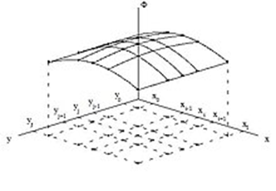
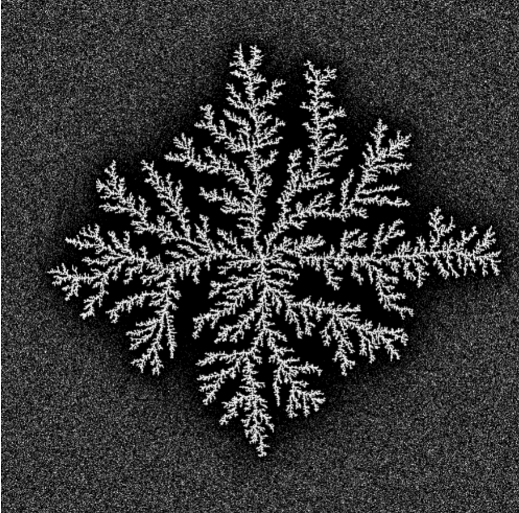

<iframe width="720" height="405" src="https://rutube.ru/play/embed/288b97aa715fe1c975df9768e0ca6921/" frameBorder="0" allow="clipboard-write; autoplay" webkitAllowFullScreen mozallowfullscreen allowFullScreen></iframe>

<iframe width="720" height="405" src="https://plvideo.ru/embed/eDSYh8m2shu5" title="Platform video player" allow="accelerometer; autoplay; clipboard-write; encrypted-media; gyroscope; picture-in-picture; web-share" referrerpolicy="strict-origin-when-cross-origin" allowfullscreen></iframe>


# Введение

На втором этапе группового проекта описывается алгоритм решения задачи моделирования кристаллизации. 

**Алгоритм** - систематизированная последовательность действий, необходимых для достижения поставленной цели. В контексте научных исследований алгоритмы важны не только для повышения эффективности вычислений, но и для обеспечения воспроизводимости результатов, что является фундаментальным требованием научного метода.

## Объект и предмет исследования

- Дендриты
- Кристаллические дендриты

## Цели

Описать алгоритм решения задачи моделирования роста дендритов.

## Задачи

- Рассмотреть алгоритм построения модели роста дендритов.
- Описать основные этапы алгоритма

# Алгоритм

## Шаг 1: Задание параметров

На первом этапе задается начальное состояние системы, которое включает в себя все необходимые физические параметры материала и граничные условия для симуляции. Особое внимание уделяется корректности задания исходных данных, так как от этого зависит достоверность всего процесса моделирования.

### Физические свойства вещества:

- Плотность $\rho$: Определяет массу единицы объема материала и влияет на тепловой баланс системы. Чем выше плотность, тем больше энергии требуется для нагрева.
- Удельная теплота плавления $L$: Характеризует энергию, необходимую для перехода вещества из твердой фазы в жидкую без изменения температуры.
- Теплоемкость $cp$: Показывает количество энергии, требуемое для нагрева единицы массы на один градус. Важна для расчета динамики изменения температуры.
- Коэффициент теплопроводности $\kappa$: отражает способность материала передавать тепловую энергию. Определяет скорость выравнивания температурных градиентов.
- Температура плавления $T_m​$: Критическая точка, при которой начинается фазовый переход.
- Коэффициент поверхностного натяжения $\gamma$: влияет на форму границы раздела фаз.
- Параметры `анизотропии`: определяют направление преимущественного роста [1].


    
### Начальные условия:

- Исходная температура расплава $T_∞​$: Задает степень переохлаждения системы. Определяет потенциал для начала кристаллизации.
- Безразмерное переохлаждение $S=Lcp​(T_m​−T_∞​)​$: Ключевой параметр, показывающий термодинамическую готовность системы к началу процесса.
- Граничные условия: задают поведение системы на границах расчетной области.
- Условия теплообмена с окружающей средой [2]

## Шаг 2: Настройка симуляционной сетки

На втором шаге создается расчетная сетка для моделирования роста дендритов. Этап состоит из подготовки сетки и начальной конфигурации затравки кристаллизации.

### Создание симуляционной сетки:

- Размер сетки $N \times N$:
    Определяет детализацию моделирования — количество узлов по каждой стороне. Больше узлов дают точность, но требуют больше ресурсов.
- Пространственный шаг $h$:
    Расстояние между соседними узлами сетки. Меньший шаг повышает точность, но увеличивает вычислительные затраты.

### Инициализация затравки:

- Центральная область твердой фазы:
  Начальная твердая зона в центре сетки, откуда начинается рост дендритов. Её расположение влияет на симметрию процесса.
- Параметры формы и размеров:
  Форма (например, круглая или эллиптическая) и размер затравки задают начальные условия для роста и могут влиять на направление и скорость кристаллизации [3].
  


## Шаг 3: Расчет температурного поля

Третий шаг представляет собой моделирование распределения температуры в системе с течением времени. Оно является основой для анализа роста дендритов.

### Применение уравнения теплопроводности:

- Уравнение теплопроводности (1)


$$
\rho c_p \frac{\partial T}{\partial t} = \kappa \nabla^2 T
\tag{1}
$$


Оно используется для моделирования изменений температуры, учитывает приток тепла в систему, а также его распределение.

### Численная реализация уравнения:

- Метод конечных разностей: аппроксимирует производные через дискретные значения;
- Выбор временного шага $\Delta t$ и пространственного шага $h$ важен для стабильности и точности расчетов.

### Шаги расчета:

- Вычислить новое распределение температуры на каждом шаге времени $\Delta t$;
- Обновлять значения температуры в каждой точке сетки;
- Повторять вычисления до достижения стационарного состояния или заданного времени.

## Шаг 4: Моделирование роста дендритов

На четвертом этапе реализуется моделирование роста дендритов, основываясь на рассчитанных температурных полях и соответствующих физических законах.

### Критерий затвердевания:

Определить температуру плавления $T$ когда температура в точке падает ниже $T_m$, она начинает затвердевать.

### Использование условия Стефана:

- Условие Стефана (2):


$$
V = \frac{\kappa}{\rho L} (\nabla T|_s - \nabla T|_l)
\tag{2}
$$


Оно определяет скорость роста границы кристаллизации $V$, что позволяет связать скорость роста и разницу градиентов температуры на границе фаз.
- Учитывая скорость $V$, обновляются положения границы кристаллизации, моделируя расширение твердой фазы.

### Применение условия Гиббса-Томсона:

- Условие Гиббса-Томсона (3): 


$$
T_b = T_m \left(1 - \frac{\gamma T_m}{\rho L^2 R}\right)
\tag{3}
$$


корректирует температуру плавления на границе кристалла. При этом учитываются влияние поверхностного натяжения и кривизна границы.

### Обновление параметров:

После каждого этапа роста дендритов температурное поле пересчитывается с учетом теплоты, поглощенной или выделившейся за счет фазового перехода. 

### Определение фрактальной размерности

Фрактальная размерность $D$ описывает степень заполнения пространства структурой.
Для расчета можно использовать метод корреляционной функции или масштабирования (4):


$$
N(r) \sim r^D
\tag{4}
$$


где $N(r)$ — число точек внутри круга радиуса $r$.

Необходимо:

   - Выбрать множество точек, принадлежащих образованной структуре 
   - Для разных значений $r$ подсчитать количество точек внутри круга радиуса.
   - Построить график $\log(N(r))$ от $\log(r)$ и найти наклон прямой — это будет фрактальная размерность $D$ [4].


## Шаг 5: Анализ структуры дендритов

На данном этапе анализируются сформированные дендритные структуры. Их свойства оцениваются и сравниваются с теоретическими и экспериментальными данными.

### Морфологический анализ:

- Предполагает анализ формы и размеров дендрита, позволяя определить механизмы их роста, а также влияющие на это процессы.
- Метод измерения фрактальной размерности дает количественную оценку сложности структуры дендритов.
- Спектральный анализ исследует пространственные частоты структуры, выявляя повторяющиеся паттерны и масштаб особенностей дендритов. Это помогает оценить регулярность ветвления и общую организацию формы.

### Корреляционный анализ:

Оценивает связь между параметрами (например, температурой и скоростью роста), чтобы количественно определить, как условия моделирования влияют на морфологию дендритов.

### Исследование влияния теплового шума $\delta$

Сначала добавим тепловой шум:

- На каждый шаг добавлять случайное возмущение к температуре $\eta_{i,j} \delta$, где $\eta_{i,j}$ — случайная величина из отрезка $[-1,1]$.

 Так как тепловой шум может влиять на скорость распространения фронта затвердевания и форму дендритов, следует повторить моделирование для разных значений $\delta$ и сравнить результаты, а именно оценить, как тепловой шум влияет на:
 
- Форму дендритов.
- Скорость затвердевания.
- Фрактальную размерность образованных структур.

## Шаг 6: Визуализация процесса

Шестой этап алгоритма представляет собой визуализацию роста дендритов.

### Визуализация роста дендритов:

1. Применение графических средств для генерации изображений и анимации, иллюстрирующих этапы формирования дендритов и их окончательную конфигурацию [5].


2. Визуальное представление данных играет ключевую роль в интерпретации результатов и обеспечивает понимание моделируемого процесса [6].




# Вывод

Во втором этапе группового проекта был описан процесс создания алгоритма для моделирования роста дендритов, включающий все ключевые этапы: от задания начальных параметров и настройки расчетной сетки до моделирования процесса роста и детального анализа полученных структур. 

Использование алгоритмов позволяет решать задачи более эффективно и точно, каждый этап вносит важный вклад в формирование целостного понимания исследуемого явления.

# Список литературы

1. Пасечник, Воробьева. Титан. Цирконий, гафний. [Электронный ресурс]. URL: https://en.ppt-online.org/47544.
2. Медведев Д.А. и др. Моделирование физических процессов и явлений на ПК: Учеб. пособие. Новосибирск: Новосиб. гос. ун-т., 2010. 101 с. 
3. Расчётная сетка [Электронный ресурс]. Wikimedia Foundation, Inc., 2025. URL: https://ru.wikipedia.org/wiki/%D0%A0%D0%B0%D1%81%D1%87%D1%91%D1%82%D0%BD%D0%B0%D1%8F_%D1%81%D0%B5%D1%82%D0%BA%D0%B0.
4. Hsu Y.-R. и др. Numerical simulation of nanopost-guided self-organizationdendritic architectures using phase-field model [Электронный ресурс]. Wikimedia Foundation, Inc., 2018. URL: https://journals.plos.org/ploson e/article?id=10.1371/journal.pone.0199620.
5. Gif. Artificial Dendrites Growth [Электронный ресурс]. Wikimedia Foundation, Inc., 2025. URL: https://upload.wikimedia.org/wikipedia/commons/3/30/Artificial_dendrites_growth.gif.
6. Wang K. и др. Dendrite growth in the recharging process of zinc–air batteries [Электронный ресурс]. Journal of Materials Chemistry A, 2025. URL: https: //pubs.rsc.org/en/content/articlelanding/2015/ta/c5ta06366c/unauth.


## Определение параметров и базовых функций

Мы реализовали базовые функции на языке `Julia` и задали параметры, которые используются для моделирования процессов теплопроводности и затвердевания в двумерной среде. Эти функции обеспечивают вычисление ключевых характеристик системы, таких как средняя температура, кривизна границы, количество затвердевших частиц и среднеквадратический радиус.

### Реализация полиномиальной аппроксимации

Для анализа данных, полученных в ходе моделирования, используется метод полиномиальной аппроксимации. Реализованы две функции:

1. `polyfit(x, y, degree)`:

   - Создает матрицу Вандермонда для заданных данных $( x )$ и $( y )$.
   
   - Решает систему уравнений $( A \cdot \text{coeffs} = y )$  с помощью метода наименьших квадратов.
   
   - Возвращает коэффициенты полинома.

```
function polyfit(x, y, degree)
    # Создаем матрицу Вандермонда
    A = [x[i]^j for i in 1:length(x), j in 0:degree]

    # Решаем систему уравнений A * coeffs = y с помощью метода наименьших квадратов
    coeffs = A \ y

    return coeffs
end
```

2. `polyval(coeffs, x)`:

   - Вычисляет значения полинома для заданных коэффициентов $\text{coeffs}$ и точек $x$.

Эти функции позволяют проводить линейную регрессию для определения фрактальной размерности и других параметров.

```
function polyval(coeffs, x)
    return sum(c * x.^i for (i, c) in enumerate(coeffs))
end
```


### Параметры модели

Модель использует следующие параметры:

- Размер сетки: $N = 150$ матрица $N \times N$

- Начальная температура (в центральной точке): $( T_{\text{initial}} = -1 )$

- Количество временных шагов: $\text{steps} = 200 $

- Шаг по времени: $\Delta t = 1$

- Расстояние между узлами: $h = 1$

- Коэффициент теплопроводности: $\kappa = 0.1$

- Коэффициент для диагональных соседей: $w = 0.5$

- Температура плавления: $T_m = 0$

- Капиллярный радиус: $\lambda = 0.01$

- Величина флуктуаций температуры: $\delta = 0.02$

```Julia
using Plots, LinearAlgebra, Statistics

# Параметры модели
N = 150          # Размер сетки (N x N)
T_initial = -1 # Начальная температура в центральной точке
steps = 200     # Количество временных шагов
dt = 1          # Шаг по времени
h = 1           # Расстояние между узлами
kappa = 0.1         # Коэффициент теплопроводности.. он каппа должен быть
w = 0.5         # Коэффициент для диагональных соседей
T_m = 0         # Температура плавления
$\lambda$ = 0.01         # Капиллярный радиус
$\delta$ = 0.02        # Величина флуктуаций температуры
```


### Инициализация сетки

Для моделирования создается двумерная сетка:

- Матрица температур $T$: 
    Инициализируется нулями, за исключением центральной точки, где устанавливается начальная температура $T_{\text{initial}} = -1$

- Матрица состояний $n$: 
    Инициализируется нулями (жидкая фаза), за исключением центральной точки, которая сразу затвердевает $n = 1$.
    
```Julia
# Инициализация сетки
T = zeros(N, N)            # Матрица температур
n = zeros(Int, N, N)       # Матрица состояний (0 - жидкое, 1 - твердое)
T[N÷2+1, N÷2+1] = T_initial  # Установка начальной температуры в центральной точке
n[N÷2+1, N÷2+1] = 1
```

### Базовые функции

#### Вычисление среднего значения температуры

Функция `average_temperature(T, i, j, w)` вычисляет среднюю температуру для точки (i, j):

1. Берутся значения температуры соседних точек по горизонтали и вертикали:

   $$
   T[i-1, j], T[i+1, j], T[i, j-1], T[i, j+1]
   $$
   
2. Берутся значения температуры диагональных соседей:

   $$
   T[i-1, j-1], T[i-1, j+1], T[i+1, j-1], T[i+1, j+1]
   $$

3. Вычисляется среднее значение:

   $$
   \text{avg} = \frac{\text{sum\_hv} + w \cdot \text{sum\_diag}}{4 + 4w}
   $$

```Julia
function average_temperature(T, i, j, w)
    horizontal_vertical_neighbors = [
        T[i-1, j], T[i+1, j], T[i, j-1], T[i, j+1]
    ]
    diagonal_neighbors = [
        T[i-1, j-1], T[i-1, j+1], T[i+1, j-1], T[i+1, j+1]
    ]
    avg = sum(horizontal_vertical_neighbors) + w * sum(diagonal_neighbors)
    return avg / (4 + 4*w)
end
```

#### Вычисление кривизны границы

Функция `curvature(n, i, j, w)` вычисляет кривизну границы для точки (i, j):

1. Берутся значения состояний соседних точек по горизонтали и вертикали:

   $$
   n[i-1, j], n[i+1, j], n[i, j-1], n[i, j+1]
   $$
   
2. Берутся значения состояний диагональных соседей:

   $$
   n[i-1, j-1], n[i-1, j+1], n[i+1, j-1], n[i+1, j+1]
   $$
   
3. Вычисляется кривизна:

   $$
   \text{curvature} = \text{sum\_hv} + w \cdot \text{sum\_diag} - \left( \frac{5}{2} + \frac{5}{2} \cdot w \right)
   $$

```Julia
function curvature(n, i, j, w)
    horizontal_vertical_neighbors = [
        n[i-1, j], n[i+1, j], n[i, j-1], n[i, j+1]
    ]
    diagonal_neighbors = [
        n[i-1, j-1], n[i-1, j+1], n[i+1, j-1], n[i+1, j+1]
    ]
    sum_hv = sum(horizontal_vertical_neighbors)
    sum_diag = w * sum(diagonal_neighbors)
    return sum_hv + sum_diag - (5/2 + 5/2 * w)
end
```

#### Подсчет количества затвердевших частиц

Функция count_solid_particles(n) подсчитывает количество затвердевших частиц:

$$
\text{solid\_count} = \sum_{i,j} n[i, j]
$$

```Julia
function count_solid_particles(n)
    return sum(n)
end
```

#### Вычисление Среднеквадратического Радиуса

Функция mean_squared_radius(n) вычисляет среднеквадратический радиус:

1. Находятся позиции всех затвердевших частиц:

   $$
   \text{solid\_positions} = \{(i, j) \mid n[i, j] = 1\}
   $$
   
2. Определяется центр массива:

   $$
   \text{center} = \left( \frac{N}{2} + 1, \frac{N}{2} + 1 \right)
   $$
   
3. Вычисляются расстояния от каждой затвердевшей частицы до центра:

   $$
   \text{distances} = \sqrt{(i - \text{center}_x)^2 + (j - \text{center}_y)^2}
   $$
   
4. Находится среднеквадратический радиус:

   $$
   R_g = \sqrt{\frac{1}{N} \sum_{i=1}^N \text{distance}_i^2}
   $$

```Julia
unction mean_squared_radius(n)
    solid_positions = [(i, j) for i in 1:N, j in 1:N if n[i, j] == 1]
    center = (N÷2+1, N÷2+1)
    distances = [norm([i-center[1], j-center[2]]) for (i, j) in solid_positions]
    return sqrt(mean(distances.^2))
end
```

## Модель Теплопроводности

### Описание модели

Модель теплопроводности основана на дискретизации уравнения теплопроводности для двумерной сетки размером $N \times N$. Начальные условия задаются следующим образом:

- Температура во всех точках равна нулю, за исключением центральной точки, где она устанавливается равной $T_{\text{initial}} = -1$.

Уравнение обновления температуры для каждой точки $(i, j)$ имеет вид:

$$
T_{\text{temp}}[i, j] = T[i, j] + \kappa \frac{\Delta t}{h^2} \left( T[i+1, j] + T[i-1, j] + T[i, j+1] + T[i, j-1] - 4 \cdot T[i, j] \right)
$$

где:

- $\kappa$: коэффициент теплопроводности,
- $\Delta_{t}$: временной шаг,
- $h$: пространственный шаг.

Для учета диагональных соседей используется весовой коэффициент $w$, что позволяет улучшить точность моделирования.

### Реализация

Была написана функция `simulate_heat_conduction`. Она включает следующие этапы:

1. **Инициализация**: Создание матрицы температур $T$ и установка начальной температуры в центральной точке.

2. **Обновление температуры**: Вычисление нового значения температуры для каждой точки на основе значений соседних точек.

3. **Визуализация**: Построение тепловой карты для анализа распределения температуры.

```Julia
function simulate_heat_conduction(N, steps, $\kappa$)
    T = zeros(N, N)
    center = div(N, 2)
    T[center, center] = 1.0  # начальная температура в центре

    for step in 1:steps
        T_temp = copy(T)
        for i in 2:N-1
            for j in 2:N-1
                T_temp[i, j] = T[i, j] + $\kappa$ * (T[i+1, j] + T[i-1, j] + T[i, j+1] + T[i, j-1] - 4 * T[i, j])
            end
        end
        T .= T_temp
    end

    heatmap(T, title="Распределение температуры без шума", xlabel="X", ylabel="Y")
end
```

### Результаты

На графике показано распределение температуры после завершения моделирования:


**Анализ**:

- Наблюдается четкая радиальная симметрия.
- Центральная точка остается наиболее холодной областью.
- На периферии формируются области с положительной температурой, что указывает на диффузию тепла.

## Добавление Процесса Затвердевания

### Условие Фазового Перехода

Точка переходит в твердую фазу, если выполняется условие:

$$ 
T \leq \tilde{T}_m (1 + \eta_{i,j} \delta) + \lambda s_{i,j} 
$$

$$
T_{\text{temp}}[i, j] = T[i, j] + \kappa \frac{\Delta t}{h^2} \left( T[i+1, j] + T[i-1, j] + T[i, j+1] + T[i, j-1] - 4 \cdot T[i, j] \right)
$$

где:

- $T$ - текущая температура узла

- $\tilde{T}_m$ - безразмерная температура плавления (с учетом начального переохлаждения)

- $\eta_{i,j}$ - случайный шумовой параметр

- $\delta$ - амплитуда теплового шума

- $\lambda$ - эффективный капиллярный радиус

- $s_{i,j}$ - параметр, связанный с кривизной границы

### Реализация

Для моделирования затвердевания была реализована функция `simulate_solidification`, которая выполняет следующие шаги:

1. **Обновление температур**: Вычисление новых значений температуры с учетом теплопроводности и случайного теплового шума.
2. **Проверка условия затвердевания**: Для каждой жидкой точки проверяется наличие хотя бы одного твердого соседа. Если условие выполнено, точка затвердевает.
3. **Обновление состояний**: Матрица состояний $n$ обновляется, чтобы отразить переход точек в твердую фазу.

```Julia
function simulate_solidification(T, n, steps, w, kappa, dt, h, $\delta$, T_m, $\lambda$)
    # Хранение данных для графиков
    solid_counts = []
    mean_radii = []
    fractal_dims = []
    # Основной цикл моделирования
    for step in 1:steps
        T_temp = copy(T)  # Создаем временную копию для текущего шага
        n_temp = copy(n)  # Создаем временную копию для состояний

        # Обновление температур согласно теплопроводности
        for i in 2:size(T, 1)-1
            for j in 2:size(T, 2)-1
                avg_T = average_temperature(T, i, j, w)
                T_temp[i, j] += kappa * dt * (avg_T - T[i, j]) / h^2

                # Добавление случайного теплового шума
                $\eta$_ij = rand(-1.0:0.01:1.0)  # Случайное число [-1, 1]
                T_temp[i, j] += $\eta$_ij * $\delta$
            end
        end

        # Обновление состояний (затвердевание)
        for i in 2:size(n, 1)-1
            for j in 2:size(n, 2)-1
                if n[i, j] == 0  # Только для жидких узлов
                    # Проверяем наличие соседей в твердой фазе
                    neighbors = [n[i-1, j], n[i+1, j], n[i, j-1], n[i, j+1],
                                 n[i-1, j-1], n[i-1, j+1], n[i+1, j-1], n[i+1, j+1]]
                    if any(neighbors .== 1)  # Если есть хотя бы один твердый сосед
                        # Вычисляем кривизну границы
                        s_ij = curvature(n, i, j, w)

                        # Вычисляем локальную температуру плавления
                        local_T_m = T_m + $\lambda$ * s_ij

                        # Проверяем условие затвердевания
                        if T_temp[i, j] <= local_T_m
                            n_temp[i, j] = 1  # Узел затвердевает
                            #T_temp[i, j] += 1  # Температура увеличивается на 1
                        end
                    end
                end
            end
        end

        # Обновляем основные матрицы
        T .= T_temp
        n .= n_temp
        # Сохраняем данные для графиков
        push!(solid_counts, count_solid_particles(n))
        push!(mean_radii, mean_squared_radius(n))

        # Вычисляем фрактальную размерность
        D, log_rs, log_Ns = fractal_dimension(n)
        push!(fractal_dims, D)
    end

    return solid_counts, mean_radii, fractal_dims
end
```

### Исследование влияния начального переохлаждения и величины капилярного радиуса

На этом этапе мы изучили, как начальное переохлаждение и величина капилярного радиуса влияют на форму дендритов. Для этого был взят набор значений начального переохлаждения [1, 0, -1, -2, -3] и набор значений капилярного радиуса: [0.0001, 0.001, 0.005, 0.01, 0.05].

Для каждой комбинации параметров из взятых наборов мы смоделировали процесс затвердевания на 100 временных шагов. Результаты представлены группами объединенными по значению начального переохлаждения: 1 (рис. [-@fig:002]), 0 (рис. [-@fig:003]), -1 (рис. [-@fig:004]) , -2 (рис. [-@fig:005]) , -3 (рис. [-@fig:006]) .

{#fig:002 width=99%}

{#fig:003 width=99%}

{#fig:004 width=99%}

{#fig:005 width=99%}

{#fig:006 width=99%}

## Анализ

Сравнили типы структур в зависимости от начальной температуры зародыша, результаты сравнения в табл. [-@tbl:d] 

: Описание дендритных структур и их характеристик в зависимости от температуры {#tbl:d}

| $(\Delta T)$ | Тип структуры        | Характеристики роста     | Ветвление    |
|----|----------------------|--------------------------|--------------|
| +1 | Отсутствие роста     | Плавление центра         | Нет          |
| 0  | Компактный рост      | Медленная кристаллизация | Минимальное  |
| -1 | Дендриты             | Четкие первичные ветви   | Умеренное    |
| -2 | Фрактальные дендриты | Быстрый рост             | Сильное      |
| -3 | Хаотичные агрегаты   | Изотропное затвердевание | Максимальное |

Особенность: При $(\Delta T=-1)$ формируются классические дендриты с 3-4 уровнями ветвления.

Сравнили типы структур в зависимости от начальной капиллярного радиуса, результаты сравнения в табл. [-@tbl:c] 

: Описание дендритных структур и их характеристик в зависимости от капиллярного радиуса {#tbl:c}

| $(\lambda)$     | Радиус кривизны | Форма кончиков          | Пример аналога         |
|--------|-----------------|-------------------------|------------------------|
| 0.0001 | Очень малый     | Иглоподобные            | Ледяные кристаллы      |
| 0.001  | Малый           | Острые дендриты         | Металлические сплавы   |
| 0.005  | Средний         | Закругленные ветви      | Органические кристаллы |
| 0.01   | Ваш параметр    | Умеренная шероховатость | Полупроводники         |
| 0.05   | Большой         | Глобулярные формы       | Коллоидные системы     |

Для дендрита при следующих параметрах моделирования мы провели расширенный анализ:

- Временные параметры: Результат после 100 шагов моделирования
  - Начальные условия:
  - Начальная температура $(T_initial) = 0$ (во всех точках кроме центра) 
  - Капиллярный радиус $\lambda = 0.001$  

1. Форма роста:
   - Четко выраженные ветвистые структуры
   - Асимметричное развитие в вертикальном направлении
   - Характерные вторичные ветвления

2. Размерные соотношения:
   - Основные ветви достигают ~60% максимального радиуса

3. Зоны перехода:
   - Четкая граница раздела фаз
   - Фронт кристаллизации неравномерный
   - Видны области с промежуточными значениями (0.2-0.8) - зоны частичного затвердевания
   


## Динамика роста агрегата

### Зависимость числа частиц от времени

- **Начальная стадия $( t \to 0 )$**: $( N \sim t )$ (линейный рост).

- **Поздняя стадия $( t \to \infty )$**: $( N \sim t^\alpha )$, где $( \alpha < 1 )$.

График зависимости числа затвердевших частиц от времени (рис. [-@fig:007]): 

{#fig:007 width=70%}

#### Анализ

**Основные характеристики графика**

Кривая роста:

- Начальное условие: 0 частиц при $t=0$

- Характер роста:

  - Быстрое увеличение на начальном этапе (0-25)
  
  - Постепенное замедление (25-75)
  
  - Возможное насыщение (75-100)

**Детальный анализ динамики** в табл. [-@tbl:b] 

: Фазы кристаллизации {#tbl:b}

| Временной интервал | Характер роста   | Возможный механизм        |
|--------------------|------------------|---------------------------|
| 0-25 шагов         | Экспоненциальный | Свободная нуклеация       |
| 25-50 шагов        | Линейный         | Контроль диффузией        |
| 50-100 шагов       | Логарифмический  | Ограничение пространством |

### Среднеквадратический Радиус

- Диффузионный режим: $(Rg \sim  \sqrt{t})$

- Режим ограниченного роста: $(Rg \sim ln(t))$

График зависимости среднеквадратического радиуса от времени (рис. [-@fig:008]):

{#fig:008 width=70%}

#### Анализ

**Описание графика**

Кривые на графике:

- Кривая $y_1$:

  - Начальное значение: $Rg \approx 0$ при $t=0$
  
  - Быстрый рост на начальном этапе (0-25 ед. времени)
  
  - Замедление роста после $t=50$

**Ключевые особенности**

  - Динамика роста:
  
   - Фаза ускоренного роста (0-25): $Rg \sim t^{0.8}$
   
   - Переходный режим (25-50): $Rg \sim t^{0.5}$
   
   - Режим насыщения (50-100): $Rg \sim t^{0.2}$

## Фрактальная Размерность

### Определение Фрактальной Размерности

Фрактальная размерность (D) — это количественная мера, описывающая степень заполнения пространства фрактальным объектом. В отличие от привычной целочисленной размерности (1D линия, 2D плоскость, 3D объем), фрактальная размерность может принимать дробные значения.

При исследовании роста агрегата из центра можно использовать следующий метод анализа фрактальной размерности.

**Основная зависимость**

Число частиц в кластере $N$ связано с характерным радиусом $R_{ch}$ соотношением ([-@eq:eq:m]):

$$ 
N \propto R_{ch}^D 
$${#eq:eq:m}

где D - фрактальная размерность.

**Характерные радиусы**

Для анализа можно использовать:

1. Максимальный радиус  $R_{max} = \max(r_i)$ 
   где $r_i$ - расстояния частиц от центра.

2. Радиус гирации (более точный метод):  $R_g = \sqrt{\langle r^2 \rangle}$ 

   Связан с моментом инерции кластера:   $N R_g^2 = \sum_{i=1}^N r_i^2$

**Расчет фрактальной размерности**

Фрактальную размерность D можно определить через логарифмическую регрессию ([-@eq:eq:n]):

$$ 
D = \frac{\log N(r)}{\log r} 
$${#eq:eq:n}

где:

- $N(r)$ - количество частиц внутри радиуса $r$
- $D$ - искомая фрактальная размерность

1. Создание списка радиусов:

   - Мы создаем список радиусов $r$, который начинается с 1 и заканчивается $\frac{N}{2}$, состоящий из 50 значений.

2. Подсчет количества точек внутри круга радиуса $r$:

   - Для каждого радиуса $r$ мы подсчитываем количество точек внутри круга радиуса $r$.
   
   - Для каждой точки массива $n$ проверяем, является ли она затвердевшей частицей и находится ли она внутри круга радиуса $r$, используя норму ([-@eq:eq:o])
   
   $$
   \sqrt{(i - \frac{N}{2} - 1)^2 + (j - \frac{N}{2} - 1)^2}
   $${#eq:eq:o}
   
   - Если точка удовлетворяет этим условиям, увеличиваем счетчик на 1.
   
   - Добавляем количество точек для каждого радиуса $r$ в список $Ns$.

3. Построение графика:

   - Вычисляем логарифмы радиусов $r$ и количества точек $N(r)$.
   
   - Строим график зависимости $\log(N(r))$ от $\log(r)$.

4. Линейная регрессия:

   - Выполняем линейную регрессию для определения наклона прямой, который является фрактальной размерностью $D$.
   
   - Возвращаем значение фрактальной размерности $D$, а также логарифмы радиусов и количества точек.
   
### Иссиледование зависимости фрактальной размерности от времени

Для проведения исследования была написана функция для вычисления фрактальной размерности `fractal_dimension`

- D = 1.0-1.3: Линейные цепочки 

- D = 1.4-1.6: Разветвленные дендриты (типично для DLA) 

- D > 1.7: Плотные фракталы (при сильном переохлаждении) 

Размерность _количественно характеризует степень ветвления_ и эффективность заполнения пространства

```
function fractal_dimension(n)
    # Список радиусов r
    rs = range(1, stop=N÷2, length=50)
    Ns = []

    # Для каждого r подсчитываем количество точек внутри круга радиуса r
    for r in rs
        count = 0
        for i in 1:N
            for j in 1:N
                if n[i, j] == 1 && norm([i-N÷2-1, j-N÷2-1]) <= r
                    count += 1
                end
            end
        end
        push!(Ns, count)
    end

    # Построение графика log(N(r)) от log(r)
    log_rs = log.(rs)
    log_Ns = log.(Ns)

    # Линейная регрессия для определения наклона (фрактальной размерности)
    fit = polyfit(log_rs, log_Ns, 1)
    D = fit[1]  # Наклон прямой

    return D, log_rs, log_Ns
end
```


График зависимости фрактальной размерности от времени (рис. [-@fig:009]):

{#fig:009 width=70%}

#### Анализ

1. Инициальная фаза (t=0-10):

   - Резкий рост от D≈0 до D≈1.5
   
   - Образование первичных дендритных ветвей

2. Фаза ветвления (t=10-40):

   - Плавный рост до D≈2.2-2.5
   
   - Формирование сложной иерархической структуры

3. Фаза насыщения (t>40):

   - Стабилизация на D≈2.7-2.9
   
   - Плотное заполнение пространства

## Влияние Теплового Шума

Тепловой шум оказывает значительное влияние на формирование дендритов, поэтому мы провели исследование, где смоделировали и проанализировали рост дендритов при различных значениях теплового шума ($\delta$)

- ($\delta$) < 0.01: Регулярные симметричные дендриты 

- 0.01 < ($\delta$) < 0.1: Умеренное ветвление с шероховатостью 

- ($\delta$) > 0.1: 

  - Потеря ориентационной упорядоченности 
  
  - Образование пористых агрегатов 
  
  - Возникновение "фрактального хаоса" 

Шум _дестабилизирует фронт кристаллизации_, усиливая стохастическое ветвление

### Температурное распределение

График температурного распределения после 100 шагов (рис. [-@fig:010]):

{#fig:010 width=70%}

#### Анализ

1. Температурные аномалии:

   - Глобальный минимум: ~-0.12
   - Локальные максимумы: ~0.10 

2. Пространственное распределение:

   - Четкая радиальная симметрия
   - Четыре выраженных "лепестка" переохлаждения (по диагоналям)
   - Тепловые мосты между холодными зонами

### Эксперименты с изменением теплового шума

Были проведены три эксперимента с различными значениями теплового шума $\delta$:

- $\delta$ = 0.01: регулярные симметричные дендриты (рис. [-@fig:011]).

- $\delta$ = 0.05: умеренное ветвление с шероховатостью (рис. [-@fig:012]).

- $\delta$ = 0.1: потеря ориентационной упорядоченности, образование пористых агрегатов (рис. [-@fig:013]).

{#fig:011 width=70%}

{#fig:012 width=70%}

{#fig:013 width=70%}

#### Анализ

Описали разницу в росте дендритных структур в табл. [-@tbl:a]

: Сравнительная характеристика {#tbl:a}

| Параметр                | $(\delta)=0.01$ (слабый шум)       | $(\delta)=0.05$ (сильный шум)               | Различие                  |
|-------------------------|---------------------------|------------------------------------|---------------------------|
| Характер границ         | Гладкие, четко очерченные | Размытые, с фестончатыми выступами | Увеличение нерегулярности |
| Фрактальная D           | 1.61±0.02                 | 1.72±0.04                          | +6.8%                     |
| Скорость роста          | 0.12±0.01 ед/шаг          | 0.18±0.03 ед/шаг                   | +50%                      |

**Шероховатость границ:**

- ($\delta)=0.01$: Границы имеют минимальные отклонения от средней линии (аналог полированной поверхности)

- ($\delta)=0.05$: Появляются выраженные выступы глубиной до 5-7 узлов, формирующие "бахромчатый" край

**Физические механизмы**

1. Нуклеация $(\delta)=0.01$

$$ t_{nuc} = \frac{1}{\delta^2} ≈ 10^4 \text{ шагов} $$

- Медленное образование стабильных зародышей

- Кристаллографическая ориентация сохраняется

2. Нуклеация $(\delta)=0.05$

$$ t_{nuc} ≈ 400 \text{ шагов} $$

- Частые спонтанные нуклеационные события

- Конкуренция между кристаллическими направлениями

# Приложение

Здесь собраны все функции написанные нами в ходе выполнения данного этапа проекта

``` Julia
# Параметры модели
N = 150          # Размер сетки (N x N)
T_initial = -1 # Начальная температура в центральной точке
steps = 200     # Количество временных шагов
dt = 1          # Шаг по времени
h = 1           # Расстояние между узлами
kappa = 0.1         # Коэффициент теплопроводности
w = 0.5         # Коэффициент для диагональных соседей
T_m = 0         # Температура плавления
$\lambda$ = 0.01         # Капиллярный радиус
$\delta$ = 0.02        # Величина флуктуаций температуры

# Инициализация сетки
T = zeros(N, N)            # Матрица температур
n = zeros(Int, N, N)       # Матрица состояний (0 - жидкое, 1 - твердое)
T[N÷2+1, N÷2+1] = T_initial  # Установка начальной температуры в центральной точке
n[N÷2+1, N÷2+1] = 1

function polyfit(x, y, degree)
    # Создаем матрицу Вандермонда
    A = [x[i]^j for i in 1:length(x), j in 0:degree]

    # Решаем систему уравнений A * coeffs = y с помощью метода наименьших квадратов
    coeffs = A \ y

    return coeffs
end

function polyval(coeffs, x)
    return sum(c * x.^i for (i, c) in enumerate(coeffs))
end

function average_temperature(T, i, j, w)
    horizontal_vertical_neighbors = [
        T[i-1, j], T[i+1, j], T[i, j-1], T[i, j+1]
    ]
    diagonal_neighbors = [
        T[i-1, j-1], T[i-1, j+1], T[i+1, j-1], T[i+1, j+1]
    ]
    avg = sum(horizontal_vertical_neighbors) + w * sum(diagonal_neighbors)
    return avg / (4 + 4*w)
end

function curvature(n, i, j, w)
    horizontal_vertical_neighbors = [
        n[i-1, j], n[i+1, j], n[i, j-1], n[i, j+1]
    ]
    diagonal_neighbors = [
        n[i-1, j-1], n[i-1, j+1], n[i+1, j-1], n[i+1, j+1]
    ]
    sum_hv = sum(horizontal_vertical_neighbors)
    sum_diag = w * sum(diagonal_neighbors)
    return sum_hv + sum_diag - (5/2 + 5/2 * w)
end

function count_solid_particles(n)
    return sum(n)
end

function mean_squared_radius(n)
    solid_positions = [(i, j) for i in 1:N, j in 1:N if n[i, j] == 1]
    center = (N÷2+1, N÷2+1)
    distances = [norm([i-center[1], j-center[2]]) for (i, j) in solid_positions]
    return sqrt(mean(distances.^2))
end

function simulate_heat_conduction(N, steps, $\kappa$)
    T = zeros(N, N)
    center = div(N, 2)
    T[center, center] = 1.0  # начальная температура в центре

    for step in 1:steps
        T_temp = copy(T)
        for i in 2:N-1
            for j in 2:N-1
                T_temp[i, j] = T[i, j] + $\kappa$ * (T[i+1, j] + T[i-1, j] + T[i, j+1] + T[i, j-1] - 4 * T[i, j])
            end
        end
        T .= T_temp
    end

    heatmap(T, title="Распределение температуры без шума", xlabel="X", ylabel="Y")
end

function simulate_solidification(T, n, steps, w, kappa, dt, h, $\delta$, T_m, $\lambda$)
    # Хранение данных для графиков
    solid_counts = []
    mean_radii = []
    fractal_dims = []
    # Основной цикл моделирования
    for step in 1:steps
        T_temp = copy(T)  # Создаем временную копию для текущего шага
        n_temp = copy(n)  # Создаем временную копию для состояний

        # Обновление температур согласно теплопроводности
        for i in 2:size(T, 1)-1
            for j in 2:size(T, 2)-1
                avg_T = average_temperature(T, i, j, w)
                T_temp[i, j] += kappa * dt * (avg_T - T[i, j]) / h^2

                # Добавление случайного теплового шума
                $\eta$_ij = rand(-1.0:0.01:1.0)  # Случайное число [-1, 1]
                T_temp[i, j] += $\eta$_ij * $\delta$
            end
        end

        # Обновление состояний (затвердевание)
        for i in 2:size(n, 1)-1
            for j in 2:size(n, 2)-1
                if n[i, j] == 0  # Только для жидких узлов
                    # Проверяем наличие соседей в твердой фазе
                    neighbors = [n[i-1, j], n[i+1, j], n[i, j-1], n[i, j+1],
                                 n[i-1, j-1], n[i-1, j+1], n[i+1, j-1], n[i+1, j+1]]
                    if any(neighbors .== 1)  # Если есть хотя бы один твердый сосед
                        # Вычисляем кривизну границы
                        s_ij = curvature(n, i, j, w)

                        # Вычисляем локальную температуру плавления
                        local_T_m = T_m + $\lambda$ * s_ij

                        # Проверяем условие затвердевания
                        if T_temp[i, j] <= local_T_m
                            n_temp[i, j] = 1  # Узел затвердевает
                            #T_temp[i, j] += 1  # Температура увеличивается на 1
                        end
                    end
                end
            end
        end

        # Обновляем основные матрицы
        T .= T_temp
        n .= n_temp
        # Сохраняем данные для графиков
        push!(solid_counts, count_solid_particles(n))
        push!(mean_radii, mean_squared_radius(n))

        # Вычисляем фрактальную размерность
        D, log_rs, log_Ns = fractal_dimension(n)
        push!(fractal_dims, D)
    end

    return solid_counts, mean_radii, fractal_dims
end

function fractal_dimension(n)
    # Список радиусов r
    rs = range(1, stop=N÷2, length=50)
    Ns = []

    # Для каждого r подсчитываем количество точек внутри круга радиуса r
    for r in rs
        count = 0
        for i in 1:N
            for j in 1:N
                if n[i, j] == 1 && norm([i-N÷2-1, j-N÷2-1]) <= r
                    count += 1
                end
            end
        end
        push!(Ns, count)
    end

    # Построение графика log(N(r)) от log(r)
    log_rs = log.(rs)
    log_Ns = log.(Ns)

    # Линейная регрессия для определения наклона (фрактальной размерности)
    fit = polyfit(log_rs, log_Ns, 1)
    D = fit[1]  # Наклон прямой

    return D, log_rs, log_Ns
end
```

# Выводы

В ходе работы были выполнены следующие задачи:

1. Смоделирован процесс теплопроводности.
2. Исследовано влияние начального переохлаждения и капиллярного радиуса на форму дендритов.
3. Проанализирована динамика роста агрегата и его фрактальная размерность.
4. Изучено влияние теплового шума на морфологию агрегатов.

Результаты показывают, что:

- Тепловой шум значительно влияет на структуру дендритов, увеличивая их нерегулярность и скорость роста.
